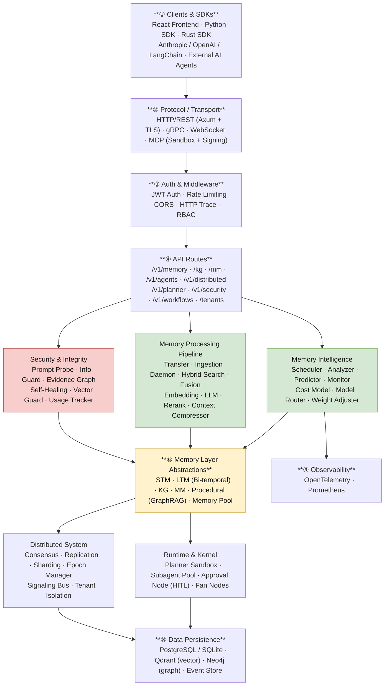

# Aetheris MemOS

<div align="center">

**The Memory Operating System for AI Agents**

[](https://opensource.org/licenses/MIT)
[](https://github.com/Colin4k1024/adaptive-memory-system/actions)
[](https://www.rust-lang.org)
[](https://nodejs.org)
[](https://deepwiki.com/Colin4k1024/adaptive-memory-system)

[Quick Start](#quick-start) · [Architecture](#architecture) · [API Docs](#api-documentation) · [Roadmap](#roadmap) · [中文文档](README.zh.md)

</div>

---

Aetheris MemOS is the memory operating system for AI agents.

Most agents today suffer from a fundamental flaw: **amnesia**. Modern agent frameworks can route prompts, call tools, and chain model invocations — but they still forget. Every session starts from zero. Every context window fills and drops. Every decision is made without the benefit of accumulated experience.

RAG partially addresses this, but retrieval alone is not memory. Real memory requires temporal structure, graph reasoning, multi-dimensional confidence estimation, adaptive compression, and explainable decisions. It requires infrastructure.

MemOS turns memory into infrastructure. It gives agents a persistent cognitive kernel spanning short-term memory, long-term memory, knowledge graphs, and multimodal context — exposed through a consistent API and an adaptive decision pipeline that routes intelligently based on task structure, not prompt engineering.

```text
Without MemOS                    With MemOS
-----------------                ----------------------------------
User prompt                      User prompt
    |                                |
    v                                v
[LLM call]                      [Memory Kernel]
    |                            |- Retrieve: triple-hybrid search
    v                            |- Reason: knowledge graph traversal
 Response                        |- Compress: adaptive context packing
(context lost)                   |- Persist: STM -> LTM promotion
                                     |
                                     v
                                 [LLM call]
                                     |
                                     v
                                 Response + memory update
                                 (agent improves over time)
```

## The Problem

As foundation models become commoditized, the durable advantage in AI systems shifts upward — into the runtime, the memory layer, and the ability to accumulate knowledge over time. The winner is not the system with the biggest context window. It is the system that remembers correctly, retrieves selectively, explains its choices, and keeps improving.

| Dimension | Stateless LLM | Basic RAG | Aetheris MemOS |
|-----------|--------------|-----------|----------------|
| Memory Persistence | Session-scoped only, lost on reset | Flat vector store, no temporal structure | Multi-layer kernel: STM → LTM promotion with bi-temporal indexing |
| Retrieval | None | Single-vector similarity | Triple hybrid: vector + keyword + graph neighborhood |
| Context Management | Hard window cutoff, no recovery | Overflow discarded silently | Adaptive compression: sliding window, importance pruning, LLM summarization, hierarchical |
| Decision Transparency | Black box | Source attribution only | Full decision trace with multi-dimensional confidence scoring |

## Positioning

```text
Application Layer      -> AI Apps / Agents / Workflows
Runtime Layer          -> LangGraph / AutoGen / Custom Orchestrators
Memory Layer           -> Aetheris MemOS
Model Layer            -> OpenAI / Ollama / vLLM / Azure OpenAI
Infrastructure Layer   -> Postgres / Qdrant / Neo4j / Object Storage
```

MemOS is not another demo chatbot. It is the memory substrate under agent systems.

## Architecture

> Full interactive diagram: [docs/architecture.drawio](docs/architecture.drawio)



## Core Capabilities

### Multi-layer memory kernel

Each memory layer is purpose-built with a dedicated backend optimized for its access pattern:

| Layer | Purpose | Backend | Key Characteristics |
|-------|---------|---------|---------------------|
| STM | Active conversational and task context | In-process + relational session storage | Sub-millisecond access, scoped to active task |
| LTM | Durable memory with semantic retrieval | PostgreSQL + Qdrant (vector index) | Bi-temporal indexing, vector similarity at scale |
| KG | Entity and relation reasoning | PostgreSQL + optional Neo4j | Temporal snapshots, contradiction detection, graph traversal |
| MM | Cross-modal memory for non-text artifacts | PostgreSQL + vector index | Multi-modal embeddings, unified retrieval across modalities |

### Adaptive scheduling

Before any memory operation, MemOS profiles the task and routes to the optimal strategy. No manual prompt engineering required.

```text
Input Analysis
    |
    v
Task Profiling
    |- complexity
    |- modality
    |- reasoning depth
    |- context dependency
    |- temporal sensitivity
    |
    v
Strategy Router
    |- Conversational context   -> STM
    |- Semantic recall          -> LTM
    |- Entity / relation query  -> KG
    |- Cross-modal expansion    -> MM
    |
    v
Weighted memory plan + decision trace
```

This allows MemOS to decide when a simple session lookup is sufficient, when long-term semantic recall matters, and when graph reasoning or multimodal expansion should be engaged — all at runtime, based on actual task structure.

### Triple hybrid retrieval

MemOS fuses three retrieval modes in a single ranked pipeline, surpassing the single-dimension limitation of traditional RAG:

```text
Vector Search    — deep semantic similarity across embedding space
+ Keyword Search — precise term matching and rule-based recall
+ Graph Search   — knowledge graph neighborhood traversal
= Fused ranking  — high-confidence, multi-dimensional memory block
```

Endpoint:

```text
POST /api/v1/memory/search/triple
```

### Confidence scoring

Every search result is enriched with multi-dimensional confidence metadata, making retrieval decisions fully explainable. Developers can see exactly why a memory was selected.

| Dimension | Signal |
|-----------|--------|
| Quality | Stored quality score at ingestion time |
| Relevance | Retrieval ranking score for the current query |
| Recency | Time-decay adjusted freshness |
| Access | Frequency-normalized usage history |
| Completeness | Content coverage heuristic |

Retrieval is no longer a black box. Every decision trace tells the agent — and the developer — why a specific memory was chosen.

Endpoint:

```text
POST /api/v1/memory/search/scored
```

### Context compression

MemOS compresses session context before it reaches the model's attention budget, protecting signal and dropping noise.

| Strategy | Description |
|----------|-------------|
| `sliding_window` | Preserve the most recent N messages; drop oldest first |
| `importance_prune` | Score and drop lowest-value context based on relevance signals |
| `llm_summary` | Summarize accumulated context into a single dense message using LLM |
| `hierarchical` | Summarize older segments while preserving recent turns verbatim |

Endpoints:

```text
POST /api/v1/memory/storage/compress/session
POST /api/v1/memory/storage/compress/messages
```

### Enterprise multi-tenancy and security

| Capability | Detail |
|------------|--------|
| Tenant isolation | Full network-level isolation per tenant; LTM quotas enforced per tenant |
| Role-based access | Member / Admin / SuperAdmin roles with fine-grained read, write, delete permissions |
| Vector space protection | Model signature guard prevents cross-model vector collapse when embedding models are upgraded |
| Data integrity | Hash-chain evidence graph detects silent information loss; memory modification tracking with tamper-proof audit log |
| Cross-agent sharing | Controlled shared knowledge within a tenant boundary for safe multi-agent reuse |

## What Is Already Implemented

- Unified DB pool with SQLite and PostgreSQL support
- SQLite WAL optimization and async write queue
- Hardware detection and model routing for CUDA, Metal, and Apple Silicon
- Vector space collapse protection through model signature checking
- Proactive memory ingestion and reflection daemon
- Bi-temporal knowledge graph with snapshots, diffs, and contradiction detection
- Triple hybrid search
- Multi-dimensional confidence scoring
- Intelligent context compression
- Adaptive strategy mutation
- Enterprise multi-tenant isolation
- Integrity protection and silent information loss guards

## Repository Layout

```text
adaptive-memory-system/
|- backend/
|  |- src/
|  |  |- routers/
|  |  |- services/
|  |  |- db/
|  |  |- models/
|  |  |- config/
|  |  `- hoops/
|  |- migrations/
|  |- examples/
|  `- docs/
|- frontend/
|  `- ant-design-pro-template/
|- docs/
|- sdks/
|  |- python/
|  `- rust/
`- docker-compose.yml
```

## Quick Start

### Prerequisites

| Dependency | Version | Notes |
|------------|---------|-------|
| Rust | 1.89+ | Required |
| Node.js | 20+ | Required for frontend |
| PostgreSQL | 14+ | Optional if using SQLite mode |
| Qdrant | 1.7+ | Required for vector search features |
| Neo4j | 5.x | Optional for graph deployment mode |
| Ollama | latest | Optional for local embeddings and LLM calls |

### Option A: backend only with SQLite

```bash
git clone https://github.com/Colin4k1024/adaptive-memory-system.git
cd adaptive-memory-system/backend
cargo run
```

Available after startup:

- API: http://127.0.0.1:8008
- Docs: http://127.0.0.1:8008/scalar

### Option B: full stack with Docker Compose

```bash
git clone https://github.com/Colin4k1024/adaptive-memory-system.git
cd adaptive-memory-system
docker-compose up -d
```

Services:

- Backend: http://localhost:8008
- Frontend: http://localhost:8000
- Qdrant: http://localhost:6333

### Option C: local backend + local frontend

```bash
cd backend
cp config.toml.example config.toml
cargo run
```

In another terminal:

```bash
cd frontend/ant-design-pro-template
npm install
npm start
```

## API Documentation

Interactive API docs are available at:

```text
http://127.0.0.1:8008/scalar
```

Key endpoints:

| Endpoint | Method | Description |
|----------|--------|-------------|
| /api/v1/memory/adaptive | POST | Adaptive memory selection |
| /api/v1/memory/search/ltm | POST | Long-term memory search |
| /api/v1/memory/search/hybrid | POST | Vector + keyword hybrid search |
| /api/v1/memory/search/triple | POST | Triple hybrid retrieval |
| /api/v1/memory/search/scored | POST | Retrieval with confidence scoring |
| /api/v1/memory/storage/stm | POST | Write short-term memory |
| /api/v1/memory/storage/ltm | POST | Write long-term memory |
| /api/v1/memory/storage/transfer | POST | Promote STM into LTM |
| /api/v1/memory/storage/compress/session | POST | Compress one session |
| /api/v1/memory/storage/compress/messages | POST | Compress arbitrary messages |
| /api/kg/entities | GET | List knowledge graph entities |
| /api/tenants | GET, POST | Tenant management |

More details are available in [docs/API_ENDPOINTS.md](https://github.com/Colin4k1024/adaptive-memory-system/blob/dev/docs/API_ENDPOINTS.md).

## Configuration

Core runtime configuration lives in `backend/config.toml`.

```toml
listen_addr = "127.0.0.1:8008"

[db]
url = "sqlite://data/memory.db"

[llm]
base_url = "http://localhost:11434"
model = "llama3"

[embedding]
base_url = "http://localhost:11434"
model = "nomic-embed-text"
dimension = 768
auto_detect = true

[qdrant]
url = "http://localhost:6333"

[rerank]
enabled = false
min_score_threshold = 0.1
candidate_multiplier = 3
```

## Tech Stack

| Layer | Technology | Notes |
|-------|------------|-------|
| Backend | Rust + Axum + Tokio | Async-first, zero-cost abstractions |
| Relational storage | PostgreSQL / SQLite via SQLx | Unified pool, SQLite WAL + async write queue |
| Vector storage | Qdrant | Native vector index, semantic search at scale |
| Graph storage | Neo4j optional integration | Bi-temporal KG with snapshot and diff support |
| Embeddings / LLM | Ollama or compatible endpoints | Ollama, OpenAI, Anthropic, and other compatible APIs |
| Hardware routing | Auto-detect CUDA / Metal / Apple Silicon | Automatic model routing based on available accelerator |
| API docs | OpenAPI + Scalar | Interactive docs at `/scalar` |
| Frontend | React + Umi + Ant Design Pro | Dashboard, task analysis, memory management |

## Product Roadmap

### Phase 1–2: Foundation & Intelligence ✅

- [x] Unified DB pool
- [x] Hardware detection and model routing
- [x] SQLite concurrency optimization
- [x] Integrity guards and vector safety
- [x] Reflection daemon and layered ingestion
- [x] Bi-temporal knowledge graph
- [x] Triple hybrid search

### Phase 3–4: Reliability & Scale ✅

- [x] Confidence scoring
- [x] Context compression
- [x] Silent information loss protection
- [x] Adaptive strategy mutation
- [x] Enterprise multi-tenancy

### Phase 5: Ecosystem Interoperability 🔭

- [ ] MemOS protocol for agent interoperability
- [ ] LangGraph and AutoGen adapters
- [ ] Distributed memory federation
- [ ] Hosted Aetheris Cloud control plane

## Aetheris Product Family

The long-term structure is larger than a single repository.

| Product | Role |
|---------|------|
| Aetheris MemOS | Memory operating system for agents — this repository |
| Aetheris Runtime | Agent execution and memory scheduling platform |
| Aetheris Graph | Graph-native knowledge substrate |
| Aetheris Control | Observability, governance, and policy plane |
| Aetheris Cloud | Managed hosted platform for enterprise |

## Development

Backend:

```bash
cd backend
cargo build
cargo test
cargo fmt
cargo clippy
```

Frontend:

```bash
cd frontend/ant-design-pro-template
npm install
npm start
npm run build
npm run lint
```

## Contributing

Contributions are welcome. See [CONTRIBUTING.md](CONTRIBUTING.md), [CONTRIBUTING.zh.md](CONTRIBUTING.zh.md), and [SECURITY.md](SECURITY.md).

## License

MIT. See [LICENSE](LICENSE).

---

Built for the agentic future.
