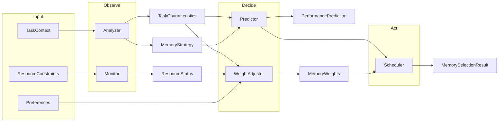

# Architecture

This document answers: **Why adaptive memory?**, **Why agent-like design?**, and **How are decisions made end-to-end?**

See also: [adaptive_memory_algorithm_design.md](adaptive_memory_algorithm_design.md) for the core algorithm and [adaptive_memory_api_specification.md](adaptive_memory_api_specification.md) for API details.

---

## High-level layer diagram

Request flow follows clear layer boundaries. **Decision Trace** is the explainability core, and the **Evidence Graph** is its audit-grade persistence model: the live API stores append-only workflow runs, nodes, and edges for the analyzer → predictor → weight adjuster → result pipeline so every memory selection can be inspected after the fact.

```
Client  →  Router (API)  →  Service  →  Agent (orchestration)  →  Strategy (pluggable)  →  Decision Trace  →  DB
```

- **Router**: HTTP, validation, error mapping; no business logic.
- **Service**: Coordinates request lifecycle, calls scheduler/agents, persists config.
- **Agent**: Orchestrates observe → decide → act (Analyzer, Predictor, Scheduler).
- **Strategy**: Pluggable policies (e.g. weight adjustment strategies).
- **Decision Trace**: Captures the in-process decision pipeline for explainability.
- **Evidence Graph**: Persists a tamper-evident workflow record for audit retrieval and offline review.

---

## Storage Architecture

The system uses multiple storage backends for different memory types:

| Memory Type          | Storage                                 | Description                   |
| -------------------- | --------------------------------------- | ----------------------------- |
| STM (Short-term)     | PostgreSQL                              | Session context, recent turns |
| LTM (Long-term)      | Qdrant + PostgreSQL                     | Vector embeddings + metadata  |
| KG (Knowledge Graph) | PostgreSQL (current) + Neo4j (optional) | Entities and relationships    |
| MM (Multimodal)      | PostgreSQL + File                       | Cross-modal memory            |

- **Qdrant**: Vector database for semantic search, stores LTM embeddings
- **Neo4j**: Optional graph backend for advanced KG scenarios
- **PostgreSQL**: Primary relational database for configurations, metrics, traces

---

## Why adaptive memory?

Agent and LLM workloads have diverse memory needs:

- **Short-term memory (STM)** — context window and recent turns; highest marginal gain but limited capacity.
- **Long-term memory (LTM)** — vector retrieval over historical data; moderate gain, scalable.
- **Knowledge graph (KG)** — structured reasoning and entity relations; stable but smaller marginal gain.
- **Multimodal memory (MM)** — cross-modal alignment; useful only for specific tasks.

A fixed configuration either over-provisions (wasting cost and latency) or under-provisions (hurting quality). An **adaptive** system chooses the right mix per task and resource constraints, balancing efficiency, coherence, and cost.

---

## Why agent-like design?

The core pipeline (analyze → predict → monitor → adjust → select) is a natural **observe–decide–act** loop. Modeling it as composable agents:

- Makes it easy to **swap rule-based logic for LLM-driven logic** later.
- Gives a clear **contribution surface**: new analyzers, predictors, or strategies.
- Aligns the narrative with modern **Agent Infrastructure**: the system is an agent-based adaptive memory manager, not just a fixed heuristic.

Today the implementation is rule-based; the abstraction is ready for optional LLM integration (see [ROADMAP.md](ROADMAP.md)).

---

## How decisions are made end-to-end

End-to-end flow:



1. **Analyzer** — Observes task context (content, modality, history) and produces `TaskCharacteristics` and a `MemoryStrategy` (primary/secondary memory, multimodal, reasoning depth).
2. **Monitor** — Observes current resource status (memory, CPU, latency, storage).
3. **Predictor** — Decides expected performance (efficiency, coherence, cost) for a candidate memory config, including synergy and decay.
4. **Weight adjuster** — Decides weight deltas from task profile, cost–benefit ratio, and preferences; produces `MemoryWeights` and adjustment reasons.
5. **Scheduler** — Acts: composes analyzer, predictor, monitor, and weight adjuster; produces the final `MemorySelectionResult` (config, prediction, resource requirements, adjustment reasons).

**Planned:** OpenTelemetry tracing export and memory decision trace visualization for full observability of this pipeline.

---

## Evidence Graph

The shipped evidence model turns each persisted workflow decision into:

- One append-only workflow run record with workflow metadata (`workflow_id`, `attempt_id`, timestamp, aggregate context).
- Ordered evidence nodes for each scheduler stage, including locked audit fields: `timestamp`, `attempt_id`, `llm_input_hash`, `llm_output_hash`, `tool_invocations`, and `context_snapshot`.
- Directed evidence edges linking the stage transitions in sequence order.

The live audit surface is `GET /api/v1/workflows/{id}/evidence`. The response returns:

- `run`: workflow-level metadata for the latest stored run of that workflow.
- `nodes`: ordered evidence nodes.
- `edges`: ordered evidence edges.
- `verification`: the replay result for the stored hash chain, including `verified`, `root_hash`, and any violations.

### Integrity Guarantees

- Evidence rows are append-only once written.
- Node verification replays the stored chain in sequence order and recomputes canonical SHA-256 hashes over the stored payload.
- The export snapshot is versioned and deterministic. Its canonical hashed body contains `schema_version`, `hash_algorithm`, `workflow_id`, `attempt_id`, `root_hash`, `chain_verified`, `nodes`, and `edges`.
- `exported_at` is kept outside the canonical export hash so the same stored workflow can be re-exported without changing the canonical body bytes.

### EU AI Act Reporting Example

For an audit request covering a high-risk workflow decision, the exported evidence snapshot can support the technical record by showing:

- Which workflow was reviewed: `workflow_id` and `attempt_id`.
- What the system observed and produced at each stage: `context_snapshot`, `tool_invocations`, `llm_input_hash`, and `llm_output_hash`.
- Whether the stored chain still matches the recorded state: `chain_verified` and `root_hash`.

This supports an audit narrative such as: "Workflow `wf-123` attempt `attempt-456` selected an adaptive memory profile after analyzer, predictor, weight adjustment, and final-result stages; the stored evidence chain verified successfully at export time."

### Limitations

- The system is tamper-evident for stored evidence, not tamper-proof for external systems.
- `chain_verified` confirms the integrity of stored data; it does not prove that external tool outputs were truthful.
- The evidence graph does not by itself define retention policy, organizational review process, or legal sufficiency under the EU AI Act.
- Planned observability work such as OpenTelemetry export and richer UI visualization remains separate from this shipped evidence API.

---

## Core Services

The backend consists of several core services:

### Scheduler (`services/scheduler.rs`)

The central orchestrator that coordinates all memory selection decisions. Integrates Analyzer, Predictor, Monitor, and WeightAdjuster.

### Analyzer (`services/analyzer.rs`)

Analyzes task context to determine memory requirements. Outputs TaskCharacteristics and MemoryStrategy.

### Predictor (`services/predictor.rs`)

Predicts performance for candidate memory configurations. Considers synergy, decay, and resource costs.

### Monitor (`services/monitor.rs`)

Observes system resources (CPU, memory, latency) and provides optimization suggestions.

### Memory Search (`services/memory_search.rs`)

Provides semantic, keyword, and hybrid search across all memory types using:

- **Embedding**: Ollama for text-to-vector conversion
- **Qdrant**: Vector similarity search
- **Rerank**: Cross-encoder reranking for improved results

### Memory Storage (`services/memory_storage.rs`)

Manages storage operations for STM, LTM, and MM memory types.

### Memory Transfer (`services/memory_transfer.rs`)

Automatically transfers relevant memories from STM to LTM based on configurable policies.

### Multimodal Memory (`services/multimodal_memory.rs`)

Handles cross-modal memory alignment and retrieval.
