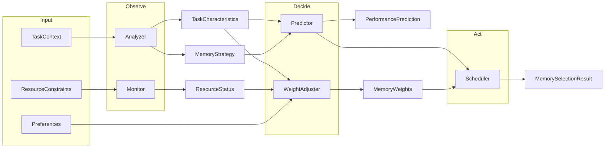

# Architecture

This document answers: **Why adaptive memory?**, **Why agent-like design?**, and **How are decisions made end-to-end?**

See also: [adaptive_memory_algorithm_design.md](adaptive_memory_algorithm_design.md) for the core algorithm and [adaptive_memory_api_specification.md](adaptive_memory_api_specification.md) for API details.

---

## High-level layer diagram

Request flow follows clear layer boundaries. **Decision Trace** is the explainability core: the trace API and UI expose the full pipeline (analyzer → predictor → weight adjuster → result) so every memory selection can be inspected.

```
Client  →  Router (API)  →  Service  →  Agent (orchestration)  →  Strategy (pluggable)  →  Decision Trace  →  DB
```

- **Router**: HTTP, validation, error mapping; no business logic.
- **Service**: Coordinates request lifecycle, calls scheduler/agents, persists config.
- **Agent**: Orchestrates observe → decide → act (Analyzer, Predictor, Scheduler).
- **Strategy**: Pluggable policies (e.g. weight adjustment strategies).
- **Decision Trace**: Captures and exposes the decision pipeline for explainability (API + UI; persistence planned).

---

## Why adaptive memory?

Agent and LLM workloads have diverse memory needs:

- **Short-term memory (STM)** — context window and recent turns; highest marginal gain but limited capacity.
- **Long-term memory (LTM)** — vector retrieval over historical data; moderate gain, scalable.
- **Knowledge graph (KG)** — structured reasoning and entity relations; stable but smaller marginal gain.
- **Multimodal memory (MM)** — cross-modal alignment; useful only for specific tasks.

A fixed configuration either over-provisions (wasting cost and latency) or under-provisions (hurting quality). An **adaptive** system chooses the right mix per task and resource constraints, balancing efficiency, coherence, and cost.

---

## Why agent-like design?

The core pipeline (analyze → predict → monitor → adjust → select) is a natural **observe–decide–act** loop. Modeling it as composable agents:

- Makes it easy to **swap rule-based logic for LLM-driven logic** later.
- Gives a clear **contribution surface**: new analyzers, predictors, or strategies.
- Aligns the narrative with modern **Agent Infrastructure**: the system is an agent-based adaptive memory manager, not just a fixed heuristic.

Today the implementation is rule-based; the abstraction is ready for optional LLM integration (see [ROADMAP.md](ROADMAP.md)).

---

## How decisions are made end-to-end

End-to-end flow:



1. **Analyzer** — Observes task context (content, modality, history) and produces `TaskCharacteristics` and a `MemoryStrategy` (primary/secondary memory, multimodal, reasoning depth).
2. **Monitor** — Observes current resource status (memory, CPU, latency, storage).
3. **Predictor** — Decides expected performance (efficiency, coherence, cost) for a candidate memory config, including synergy and decay.
4. **Weight adjuster** — Decides weight deltas from task profile, cost–benefit ratio, and preferences; produces `MemoryWeights` and adjustment reasons.
5. **Scheduler** — Acts: composes analyzer, predictor, monitor, and weight adjuster; produces the final `MemorySelectionResult` (config, prediction, resource requirements, adjustment reasons).

**Planned:** OpenTelemetry tracing export and memory decision trace visualization for full observability of this pipeline.
