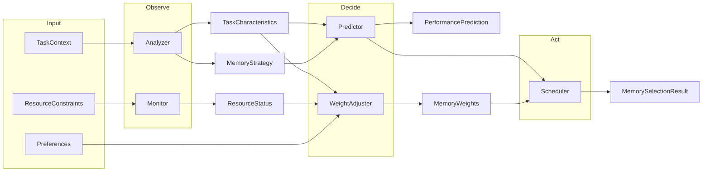

# 架构设计

本文档回答：**为什么选择自适应记忆？**、**为什么采用类智能体设计？**以及**决策如何端到端完成？**

另请参阅：[adaptive_memory_algorithm_design.md](adaptive_memory_algorithm_design.md) 了解核心算法，以及 [adaptive_memory_api_specification.md](adaptive_memory_api_specification.md) 了解 API 详情。

---

## 高级层级图

请求流程遵循清晰的层级边界。**决策追踪**是解释性的核心：追踪 API 和 UI 暴露完整管道（分析器 → 预测器 → 权重调整器 → 结果），以便检查每个记忆选择。

```
客户端 → 路由层 (API) → 服务层 → 智能体 (编排) → 策略 (可插拔) → 决策追踪 → 数据库
```

- **路由层**: HTTP、验证、错误映射；无业务逻辑。
- **服务层**: 协调请求生命周期，调用调度器/智能体，持久化配置。
- **智能体**: 编排 observe → decide → act（分析器、预测器、调度器）。
- **策略**: 可插拔策略（例如权重调整策略）。
- **决策追踪**: 捕获并暴露决策管道以实现可解释性（API + UI；持久化已规划）。

---

## 为什么选择自适应记忆？

智能体和 LLM 工作负载具有多样化的记忆需求：

- **短期记忆 (STM)** — 上下文窗口和最近轮次；边际收益最高但容量有限。
- **长期记忆 (LTM)** — 历史数据的向量检索；中等收益，可扩展。
- **知识图谱 (KG)** — 结构化推理和实体关系；稳定但边际收益较小。
- **多模态记忆 (MM)** — 跨模态对齐；仅对特定任务有用。

固定配置会导致过度配置（浪费成本和延迟）或配置不足（影响质量）。**自适应**系统根据任务和资源约束选择正确的组合，平衡效率、一致性和成本。

---

## 为什么采用类智能体设计？

核心管道（分析 → 预测 → 监控 → 调整 → 选择）是一个自然的 **observe–decide–act** 循环。将其建模为可组合的智能体：

- 使得以后**轻松将基于规则的逻辑替换为 LLM 驱动的逻辑**成为可能。
- 提供清晰的**贡献面**：新的分析器、预测器或策略。
- 与现代**智能体基础设施**叙事保持一致：系统是一个基于智能体的自适应记忆管理器，而不仅仅是固定的启发式算法。

当前实现是基于规则的；抽象已准备好可选的 LLM 集成（参见 [ROADMAP.md](ROADMAP.md)）。

---

## 决策如何端到端完成

端到端流程：



1. **分析器** — 观察任务上下文（内容、模态、历史）并产生 `TaskCharacteristics` 和 `MemoryStrategy`（主要/次要记忆、多模态、推理深度）。
2. **监控器** — 观察当前资源状态（内存、CPU、延迟、存储）。
3. **预测器** — 决定候选记忆配置的预期性能（效率、一致性、成本），包括协同效应和衰减。
4. **权重调整器** — 根据任务档案、成本收益比和偏好决定权重增量；产生 `MemoryWeights` 和调整原因。
5. **调度器** — 执行：组合分析器、预测器、监控器和权重调整器；产生最终的 `MemorySelectionResult`（配置、预测、资源需求、调整原因）。

**已规划：** OpenTelemetry 追踪导出和记忆决策追踪可视化，以实现此管道的完全可观测性。
