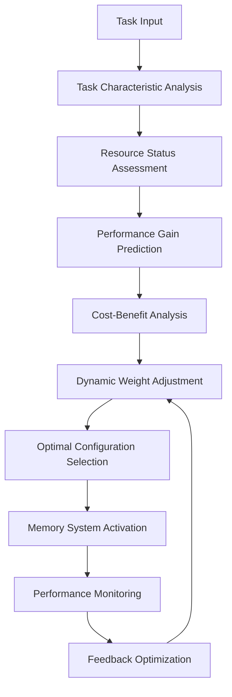
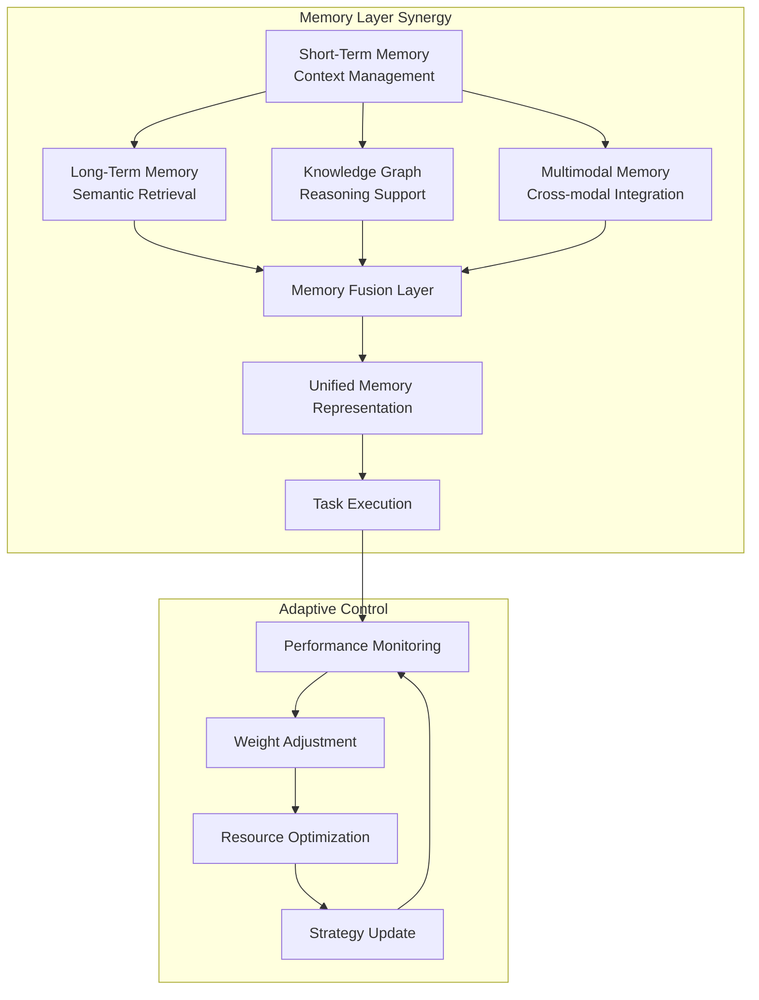

# Adaptive Memory Management Algorithm Core Design

## Algorithm Design Overview

Based on key findings from memory system research reports, this document designs an adaptive memory management algorithm that dynamically balances resource consumption with performance gains. The algorithm implements intelligent scheduling of Short-Term Memory (STM), Long-Term Memory (LTM), and Knowledge Graph (KG), while supporting optimized management of Multimodal Memory (MM).

## Core Design Principles

### 1. Layered Memory Architecture Mapping

```
Short-Term Memory (STM) ←→ Context Window Management
Long-Term Memory (LTM) ←→ Vector Database Retrieval
Knowledge Graph (KG) ←→ Structured Knowledge Reasoning
Multimodal Memory (MM) ←→ Cross-modal Information Integration
```

### 2. Diminishing Marginal Returns Compensation Mechanism

Based on the diminishing marginal returns pattern revealed in research data, a dynamic weight adjustment strategy is designed:

- **Short-Term Memory**: Provides maximum absolute performance gain (24.73%), given highest priority
- **Long-Term Memory**: Medium performance gain (7.81%), using on-demand loading strategy
- **Knowledge Graph**: Smaller but stable gain (3.67%), used for complex reasoning scenarios
- **Multimodal Memory**: Minimum gain (0.26%), enabled only for specific tasks

## Core Algorithm Architecture

### 1. Adaptive Memory Scheduler

```python
class AdaptiveMemoryScheduler:
    def __init__(self):
        self.memory_layers = {
            'stm': ShortTermMemory(),
            'ltm': LongTermMemory(),
            'kg': KnowledgeGraph(),
            'mm': MultiModalMemory()
        }
        self.performance_tracker = PerformanceTracker()
        self.resource_monitor = ResourceMonitor()
        self.decision_engine = MemoryDecisionEngine()
    
    def adaptive_memory_selection(self, task_context, resource_constraints):
        """Core algorithm for adaptive memory selection"""
        # 1. Task characteristic analysis
        task_profile = self.analyze_task_characteristics(task_context)
        
        # 2. Resource status assessment
        resource_status = self.resource_monitor.get_current_status()
        
        # 3. Performance gain prediction
        performance_predictions = self.predict_memory_performance(task_profile)
        
        # 4. Cost-benefit analysis
        cost_benefit_ratio = self.calculate_cost_benefit_ratio(
            performance_predictions, resource_status
        )
        
        # 5. Dynamic weight adjustment
        memory_weights = self.adjust_memory_weights(
            task_profile, cost_benefit_ratio
        )
        
        # 6. Optimal memory combination selection
        optimal_memory_config = self.select_optimal_configuration(
            memory_weights, resource_constraints
        )
        
        return optimal_memory_config
```

### 2. Task Characteristic Analyzer

```python
class TaskCharacteristicAnalyzer:
    def analyze_task_characteristics(self, task_context):
        """Analyze task characteristics to determine memory requirements"""
        characteristics = {
            'complexity': self.assess_task_complexity(task_context),
            'modality': self.detect_modality_requirements(task_context),
            'temporal_scope': self.analyze_temporal_requirements(task_context),
            'reasoning_depth': self.evaluate_reasoning_requirements(task_context),
            'context_dependency': self.measure_context_dependency(task_context)
        }
        
        # Determine memory strategy based on characteristics
        memory_strategy = self.determine_memory_strategy(characteristics)
        return memory_strategy
    
    def determine_memory_strategy(self, characteristics):
        """Determine memory strategy based on task characteristics"""
        strategy = {
            'primary_memory': 'stm',  # Default: Short-term memory
            'secondary_memory': [],
            'enable_multimodal': False,
            'reasoning_depth': 'shallow'
        }
        
        # Complex tasks require long-term memory
        if characteristics['complexity'] > 0.7:
            strategy['secondary_memory'].append('ltm')
        
        # Multimodal tasks enable multimodal memory
        if characteristics['modality'] > 1:
            strategy['enable_multimodal'] = True
            strategy['secondary_memory'].append('mm')
        
        # Deep reasoning tasks require knowledge graph
        if characteristics['reasoning_depth'] > 0.8:
            strategy['secondary_memory'].append('kg')
            strategy['reasoning_depth'] = 'deep'
        
        return strategy
```

### 3. Performance Prediction Model

```python
class PerformancePredictionModel:
    def __init__(self):
        # Research-based performance baseline data
        self.performance_baselines = {
            'stm': {'efficiency_gain': 0.2473, 'coherence_gain': 0.5447},
            'ltm': {'efficiency_gain': 0.3698, 'coherence_gain': 1.3751},
            'kg': {'efficiency_gain': 0.4273, 'coherence_gain': 1.5970},
            'mm': {'efficiency_gain': 0.4314, 'coherence_gain': 1.9312}
        }
        
        # Diminishing marginal returns factors
        self.marginal_decay_factors = {
            'stm_to_ltm': 0.495,  # 7.81/15.76
            'ltm_to_kg': 0.470,   # 3.67/7.81
            'kg_to_mm': 0.071     # 0.26/3.67
        }
    
    def predict_memory_performance(self, task_profile, memory_config):
        """Predict performance for a specific memory configuration"""
        base_performance = self.performance_baselines[memory_config['primary_memory']]
        
        # Calculate synergy factor for combined memories
        synergy_factor = self.calculate_synergy_factor(memory_config)
        
        # Apply diminishing marginal returns
        decay_factor = self.calculate_decay_factor(memory_config)
        
        predicted_performance = {
            'efficiency': base_performance['efficiency_gain'] * synergy_factor * decay_factor,
            'coherence': base_performance['coherence_gain'] * synergy_factor * decay_factor,
            'resource_cost': self.estimate_resource_cost(memory_config)
        }
        
        return predicted_performance
```

### 4. Resource Monitor & Optimizer

```python
class ResourceMonitor:
    def __init__(self):
        self.resource_limits = {
            'memory_usage': 0.8,      # 80% memory usage limit
            'cpu_usage': 0.8,         # 80% CPU usage limit
            'response_time': 2.0,     # 2 second response time limit
            'storage_quota': 0.9      # 90% storage quota limit
        }
        
    def get_current_status(self):
        """Get current resource status"""
        return {
            'memory_usage': self.get_memory_usage(),
            'cpu_usage': self.get_cpu_usage(),
            'response_time': self.get_avg_response_time(),
            'storage_usage': self.get_storage_usage()
        }
    
    def calculate_cost_benefit_ratio(self, performance_prediction, resource_status):
        """Calculate cost-benefit ratio"""
        performance_score = (
            performance_prediction['efficiency'] * 0.6 + 
            performance_prediction['coherence'] * 0.4
        )
        
        resource_cost = self.calculate_resource_cost(resource_status)
        
        return performance_score / resource_cost if resource_cost > 0 else float('inf')
```

### 5. Dynamic Weight Adjustment Mechanism

```python
class DynamicWeightAdjuster:
    def adjust_memory_weights(self, task_profile, cost_benefit_ratio):
        """Dynamically adjust memory layer weights"""
        base_weights = {
            'stm': 1.0,    # Short-term memory always enabled
            'ltm': 0.0,    # Long-term memory enabled on-demand
            'kg': 0.0,     # Knowledge graph enabled on-demand
            'mm': 0.0      # Multimodal memory enabled on-demand
        }
        
        # Adjust based on task complexity
        if task_profile['complexity'] > 0.5:
            base_weights['ltm'] = min(0.8, task_profile['complexity'])
        
        # Adjust based on multimodal requirements
        if task_profile['modality'] > 1:
            base_weights['mm'] = min(0.6, task_profile['modality'] * 0.3)
        
        # Adjust based on reasoning depth
        if task_profile['reasoning_depth'] > 0.7:
            base_weights['kg'] = min(0.7, task_profile['reasoning_depth'])
        
        # Adjust based on cost-benefit ratio
        if cost_benefit_ratio < 1.0:  # Reduce complex memories when cost-benefit is low
            base_weights['ltm'] *= 0.5
            base_weights['kg'] *= 0.5
            base_weights['mm'] *= 0.5
        
        return base_weights
```

## Core Algorithm Flow

### 1. Adaptive Memory Selection Flow



### 2. Memory Layer Synergy Mechanism



## Key Innovations

### 1. Diminishing Marginal Returns Compensation
- Establish precise performance prediction model based on research data
- Implement dynamic balance of cost-benefit
- Avoid resource waste from over-complication

### 2. Multimodal Memory Optimization
- Support intelligent integration of visual, auditory, and other multimodal information
- Dynamically enable multimodal memory based on task requirements
- Achieve semantic alignment of cross-modal information

### 3. Real-time Performance Monitoring
- Continuously monitor system performance and resource usage
- Dynamically adjust memory strategy based on feedback data
- Implement adaptive system optimization

### 4. Layered Memory Synergy
- Intelligent synergy between different memory layers
- Avoid information redundancy and conflicts
- Achieve effective integration of memory information

## Implementation Recommendations

### 1. Progressive Deployment
- First implement basic adaptive short-term memory management
- Gradually add long-term memory and knowledge graph support
- Finally integrate multimodal memory capabilities

### 2. Performance Baseline Establishment
- Establish standardized performance evaluation system
- Conduct regular performance benchmark testing
- Continuously optimize algorithm parameters

### 3. Monitoring and Tuning
- Implement comprehensive performance monitoring system
- Establish automated tuning mechanisms
- Support manual intervention and strategy adjustment

This adaptive memory management algorithm design fully considers key findings from research reports, particularly the diminishing marginal returns pattern and the complexity of multimodal memory, providing a scientific and efficient solution for agent memory systems.
