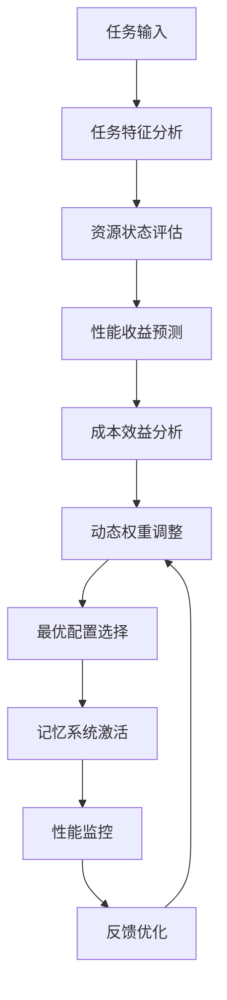
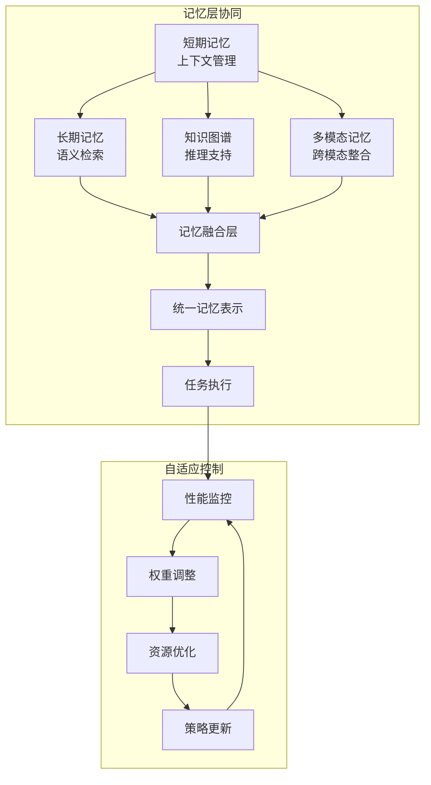

# 自适应记忆管理算法核心设计

## 算法设计概述

基于记忆体系研究报告的关键发现，设计一个能够动态平衡资源消耗与性能收益的自适应记忆管理算法。该算法将实现短期记忆、长期记忆和知识图谱的智能调度，并支持多模态记忆的优化管理。

## 核心设计原理

### 1. 分层记忆架构映射

```
短期记忆 (STM) ←→ 上下文窗口管理
长期记忆 (LTM) ←→ 向量数据库检索
知识图谱 (KG) ←→ 结构化知识推理
多模态记忆 (MM) ←→ 跨模态信息整合
```

### 2. 边际效益递减补偿机制

基于研究数据显示的边际效益递减规律，设计动态权重调整策略：

- **短期记忆**：提供最大绝对性能提升（24.73%），给予最高优先级
- **长期记忆**：中等性能提升（7.81%），采用按需加载策略
- **知识图谱**：较小但稳定的提升（3.67%），用于复杂推理场景
- **多模态记忆**：最小提升（0.26%），仅在特定任务中启用

## 核心算法架构

### 1. 自适应记忆调度器 (Adaptive Memory Scheduler)

```python
class AdaptiveMemoryScheduler:
    def __init__(self):
        self.memory_layers = {
            'stm': ShortTermMemory(),
            'ltm': LongTermMemory(), 
            'kg': KnowledgeGraph(),
            'mm': MultiModalMemory()
        }
        self.performance_tracker = PerformanceTracker()
        self.resource_monitor = ResourceMonitor()
        self.decision_engine = MemoryDecisionEngine()
    
    def adaptive_memory_selection(self, task_context, resource_constraints):
        """自适应记忆选择核心算法"""
        # 1. 任务特征分析
        task_profile = self.analyze_task_characteristics(task_context)
        
        # 2. 资源状态评估
        resource_status = self.resource_monitor.get_current_status()
        
        # 3. 性能收益预测
        performance_predictions = self.predict_memory_performance(task_profile)
        
        # 4. 成本效益分析
        cost_benefit_ratio = self.calculate_cost_benefit_ratio(
            performance_predictions, resource_status
        )
        
        # 5. 动态权重调整
        memory_weights = self.adjust_memory_weights(
            task_profile, cost_benefit_ratio
        )
        
        # 6. 最优记忆组合选择
        optimal_memory_config = self.select_optimal_configuration(
            memory_weights, resource_constraints
        )
        
        return optimal_memory_config
```

### 2. 任务特征分析器 (Task Characteristic Analyzer)

```python
class TaskCharacteristicAnalyzer:
    def analyze_task_characteristics(self, task_context):
        """分析任务特征，确定记忆需求"""
        characteristics = {
            'complexity': self.assess_task_complexity(task_context),
            'modality': self.detect_modality_requirements(task_context),
            'temporal_scope': self.analyze_temporal_requirements(task_context),
            'reasoning_depth': self.evaluate_reasoning_requirements(task_context),
            'context_dependency': self.measure_context_dependency(task_context)
        }
        
        # 基于特征确定记忆策略
        memory_strategy = self.determine_memory_strategy(characteristics)
        return memory_strategy
    
    def determine_memory_strategy(self, characteristics):
        """基于任务特征确定记忆策略"""
        strategy = {
            'primary_memory': 'stm',  # 默认短期记忆
            'secondary_memory': [],
            'enable_multimodal': False,
            'reasoning_depth': 'shallow'
        }
        
        # 复杂任务需要长期记忆
        if characteristics['complexity'] > 0.7:
            strategy['secondary_memory'].append('ltm')
        
        # 多模态任务启用多模态记忆
        if characteristics['modality'] > 1:
            strategy['enable_multimodal'] = True
            strategy['secondary_memory'].append('mm')
        
        # 深度推理任务需要知识图谱
        if characteristics['reasoning_depth'] > 0.8:
            strategy['secondary_memory'].append('kg')
            strategy['reasoning_depth'] = 'deep'
        
        return strategy
```

### 3. 性能预测模型 (Performance Prediction Model)

```python
class PerformancePredictionModel:
    def __init__(self):
        # 基于研究报告的性能基准数据
        self.performance_baselines = {
            'stm': {'efficiency_gain': 0.2473, 'coherence_gain': 0.5447},
            'ltm': {'efficiency_gain': 0.3698, 'coherence_gain': 1.3751},
            'kg': {'efficiency_gain': 0.4273, 'coherence_gain': 1.5970},
            'mm': {'efficiency_gain': 0.4314, 'coherence_gain': 1.9312}
        }
        
        # 边际效益递减系数
        self.marginal_decay_factors = {
            'stm_to_ltm': 0.495,  # 7.81/15.76
            'ltm_to_kg': 0.470,   # 3.67/7.81
            'kg_to_mm': 0.071     # 0.26/3.67
        }
    
    def predict_memory_performance(self, task_profile, memory_config):
        """预测特定记忆配置的性能表现"""
        base_performance = self.performance_baselines[memory_config['primary_memory']]
        
        # 计算组合记忆的协同效应
        synergy_factor = self.calculate_synergy_factor(memory_config)
        
        # 应用边际效益递减
        decay_factor = self.calculate_decay_factor(memory_config)
        
        predicted_performance = {
            'efficiency': base_performance['efficiency_gain'] * synergy_factor * decay_factor,
            'coherence': base_performance['coherence_gain'] * synergy_factor * decay_factor,
            'resource_cost': self.estimate_resource_cost(memory_config)
        }
        
        return predicted_performance
```

### 4. 资源监控与优化器 (Resource Monitor & Optimizer)

```python
class ResourceMonitor:
    def __init__(self):
        self.resource_limits = {
            'memory_usage': 0.8,      # 80% 内存使用率上限
            'cpu_usage': 0.8,         # 80% CPU使用率上限
            'response_time': 2.0,     # 2秒响应时间上限
            'storage_quota': 0.9      # 90% 存储配额上限
        }
        
    def get_current_status(self):
        """获取当前资源状态"""
        return {
            'memory_usage': self.get_memory_usage(),
            'cpu_usage': self.get_cpu_usage(),
            'response_time': self.get_avg_response_time(),
            'storage_usage': self.get_storage_usage()
        }
    
    def calculate_cost_benefit_ratio(self, performance_prediction, resource_status):
        """计算成本效益比"""
        performance_score = (
            performance_prediction['efficiency'] * 0.6 + 
            performance_prediction['coherence'] * 0.4
        )
        
        resource_cost = self.calculate_resource_cost(resource_status)
        
        return performance_score / resource_cost if resource_cost > 0 else float('inf')
```

### 5. 动态权重调整机制 (Dynamic Weight Adjustment)

```python
class DynamicWeightAdjuster:
    def adjust_memory_weights(self, task_profile, cost_benefit_ratio):
        """动态调整记忆层权重"""
        base_weights = {
            'stm': 1.0,    # 短期记忆始终启用
            'ltm': 0.0,    # 长期记忆按需启用
            'kg': 0.0,     # 知识图谱按需启用
            'mm': 0.0      # 多模态记忆按需启用
        }
        
        # 基于任务复杂度调整
        if task_profile['complexity'] > 0.5:
            base_weights['ltm'] = min(0.8, task_profile['complexity'])
        
        # 基于多模态需求调整
        if task_profile['modality'] > 1:
            base_weights['mm'] = min(0.6, task_profile['modality'] * 0.3)
        
        # 基于推理深度调整
        if task_profile['reasoning_depth'] > 0.7:
            base_weights['kg'] = min(0.7, task_profile['reasoning_depth'])
        
        # 基于成本效益比调整
        if cost_benefit_ratio < 1.0:  # 成本效益比低时减少复杂记忆
            base_weights['ltm'] *= 0.5
            base_weights['kg'] *= 0.5
            base_weights['mm'] *= 0.5
        
        return base_weights
```

## 核心算法流程

### 1. 自适应记忆选择流程



### 2. 记忆层协同机制



## 关键创新点

### 1. 边际效益递减补偿
- 基于研究数据建立精确的性能预测模型
- 实现成本效益的动态平衡
- 避免过度复杂化导致的资源浪费

### 2. 多模态记忆优化
- 支持视觉、听觉等多模态信息的智能整合
- 基于任务需求动态启用多模态记忆
- 实现跨模态信息的语义对齐

### 3. 实时性能监控
- 持续监控系统性能和资源使用情况
- 基于反馈数据动态调整记忆策略
- 实现自适应的系统优化

### 4. 分层记忆协同
- 不同记忆层之间的智能协同
- 避免信息冗余和冲突
- 实现记忆信息的有效整合

## 实现建议

### 1. 渐进式部署
- 首先实现基础的自适应短期记忆管理
- 逐步添加长期记忆和知识图谱支持
- 最后集成多模态记忆功能

### 2. 性能基准建立
- 建立标准化的性能评估体系
- 定期进行性能基准测试
- 持续优化算法参数

### 3. 监控与调优
- 实现全面的性能监控系统
- 建立自动化的调优机制
- 支持人工干预和策略调整

这个自适应记忆管理算法设计充分考虑了研究报告中的关键发现，特别是边际效益递减规律和多模态记忆的复杂性，为智能体记忆系统提供了科学、高效的解决方案。
