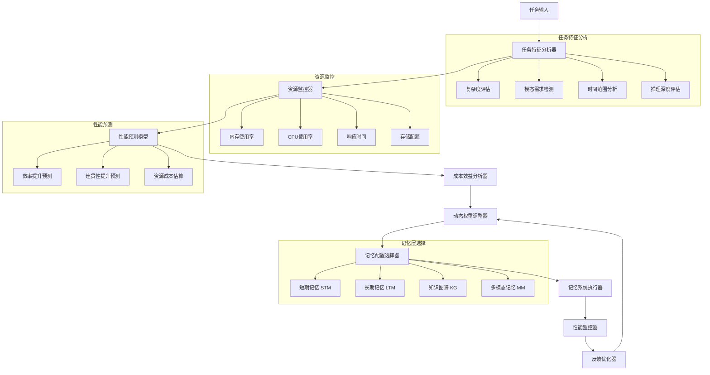
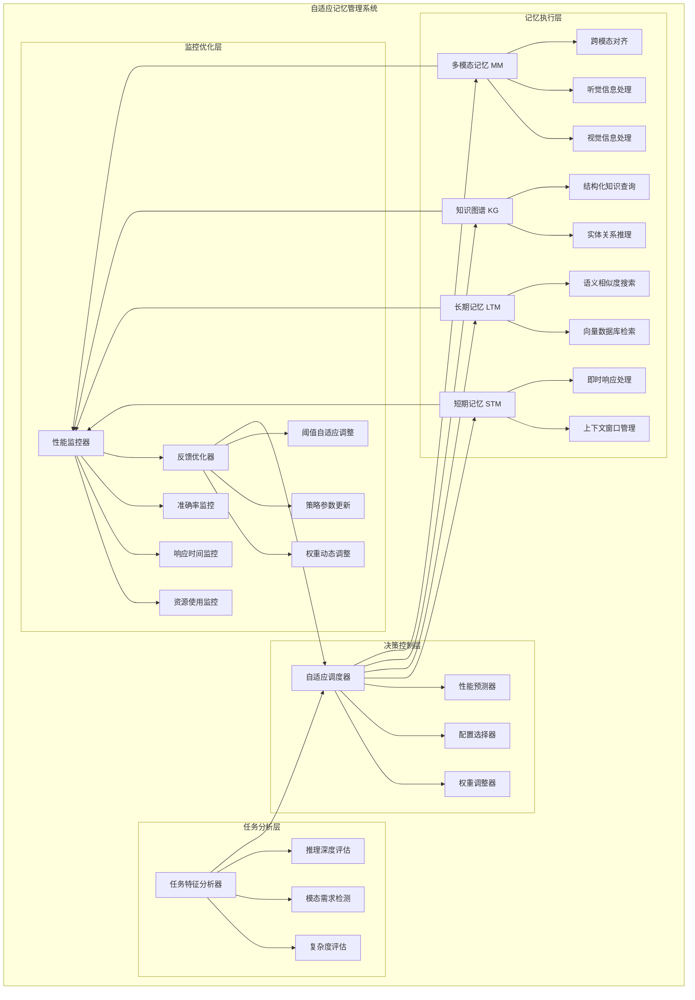
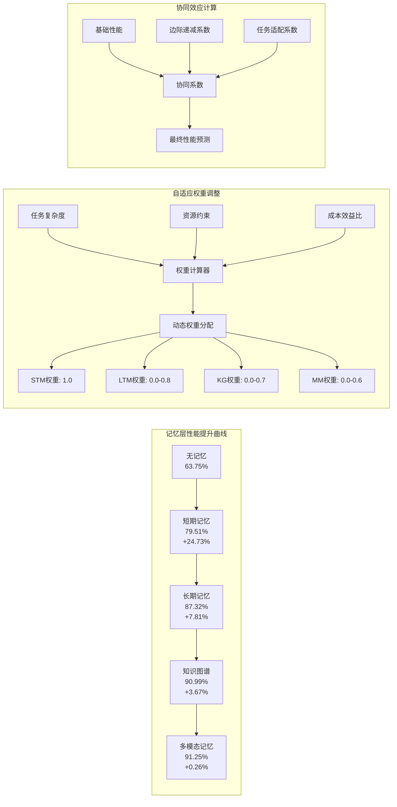
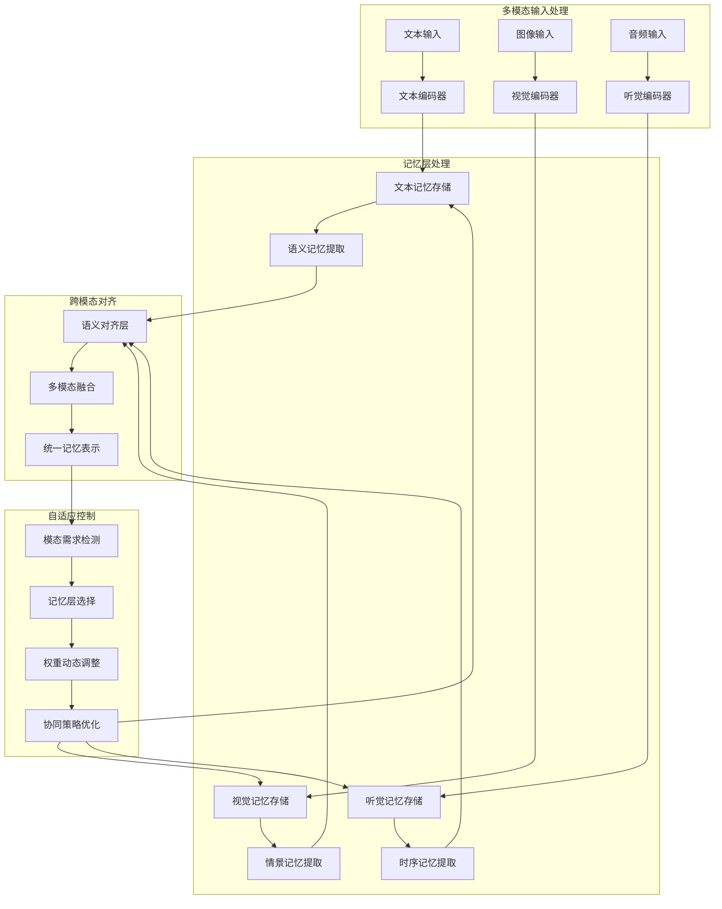
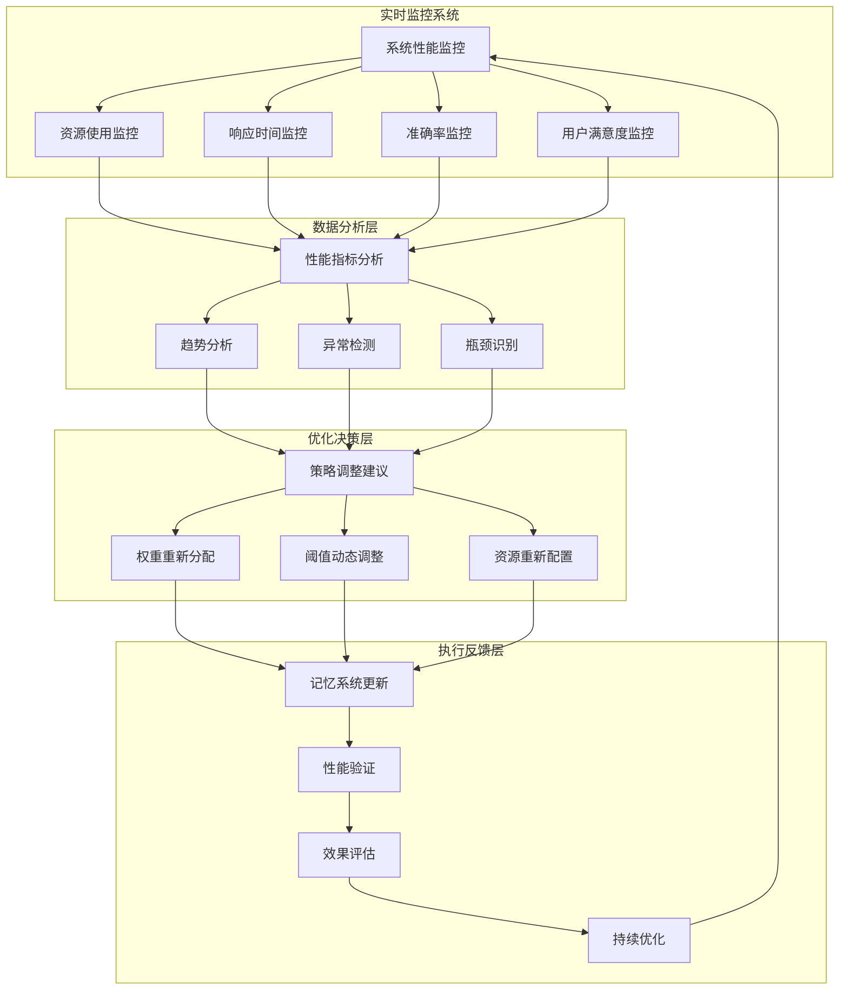
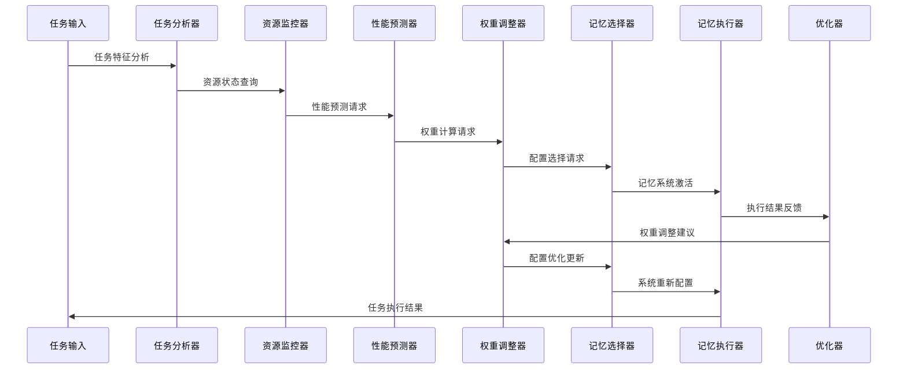

# 自适应记忆管理算法可视化设计

## 核心算法流程图

## 分层记忆架构图

## 边际效益递减补偿机制图

## 多模态记忆整合架构图

## 性能监控与优化反馈循环

## 关键算法组件交互图

这些可视化图表完整展示了自适应记忆管理算法的核心设计，包括：

1. **核心算法流程**：从任务输入到记忆系统执行的完整流程
2. **分层架构设计**：四层记忆系统的协同工作机制
3. **边际效益补偿**：基于研究数据的动态权重调整机制
4. **多模态整合**：跨模态信息的智能处理和融合
5. **监控优化循环**：实时性能监控和自适应优化机制
6. **组件交互**：各算法组件之间的协作关系

整个设计充分体现了研究报告中的关键发现，特别是边际效益递减规律和多模态记忆的复杂性，为智能体记忆系统提供了科学、高效的解决方案。
