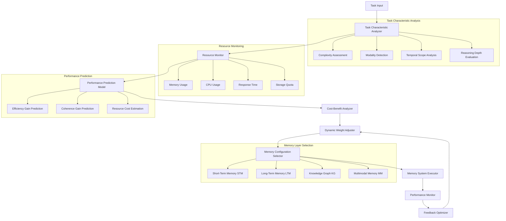
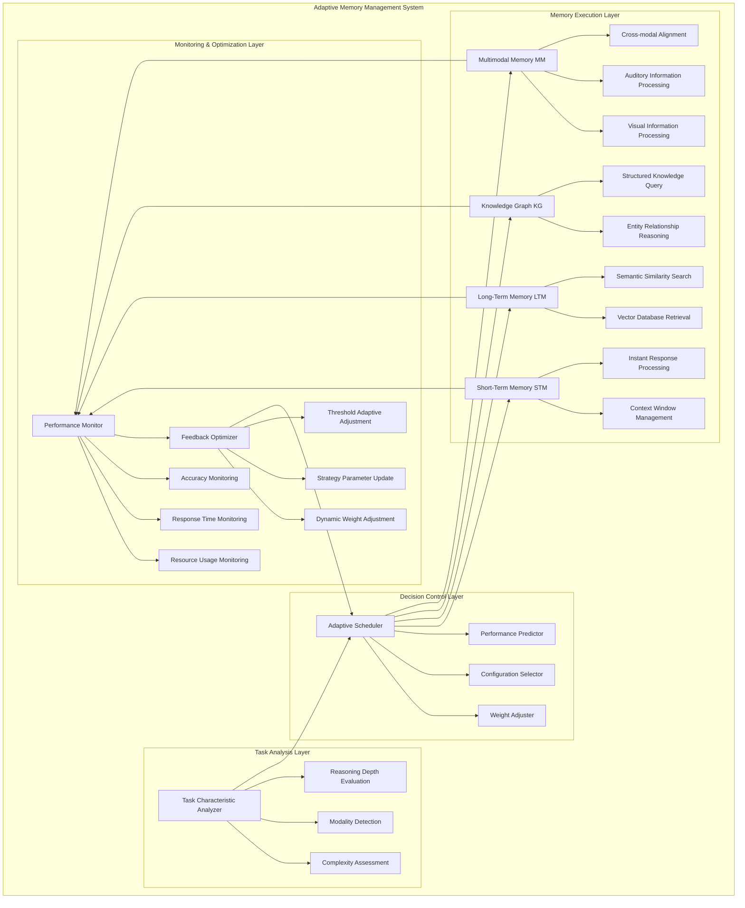
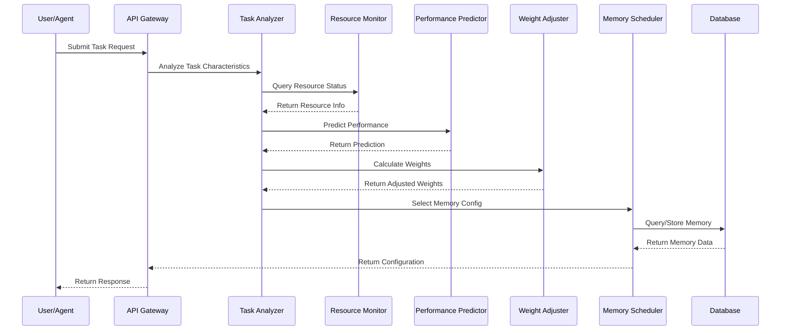
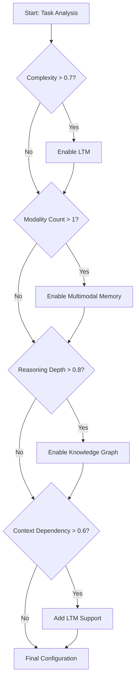
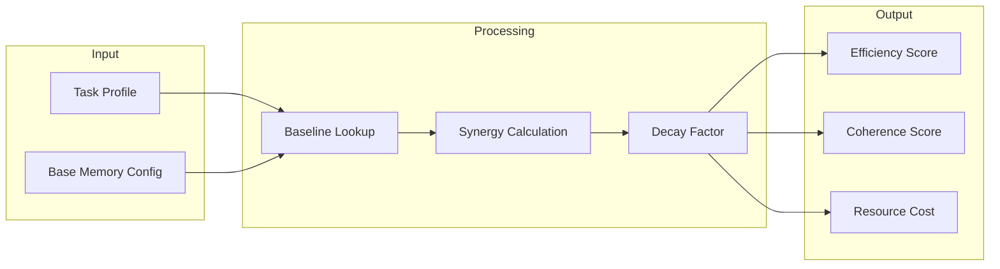
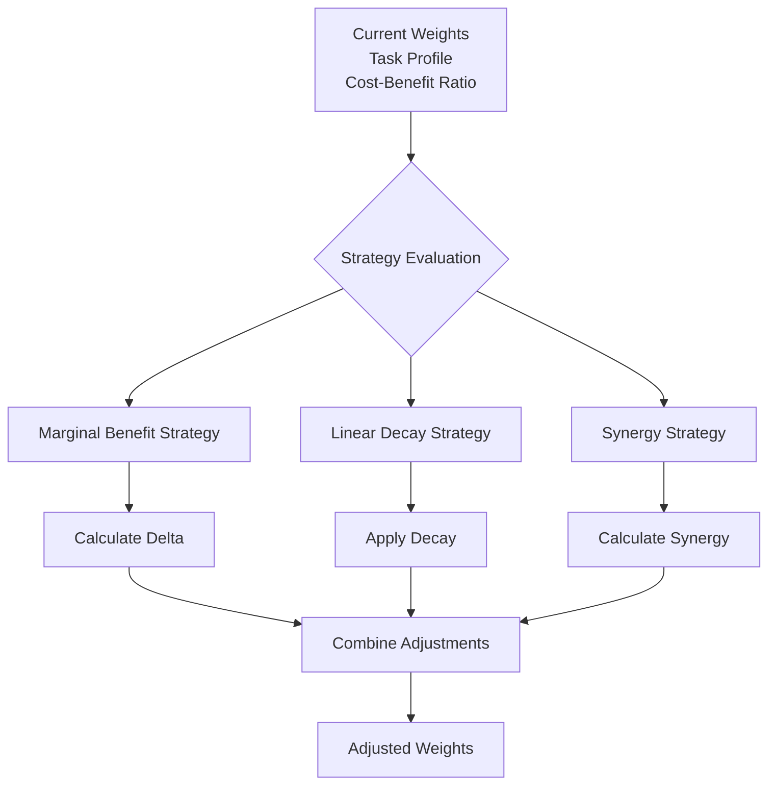

# Adaptive Memory Management Algorithm Visualization Design

## Core Algorithm Flowchart



## Layered Memory Architecture Diagram



## Component Interaction Sequence Diagram



## Decision Tree: Memory Layer Selection



## Performance Prediction Model Diagram



## Weight Adjustment Process Diagram



## Resource Monitoring Dashboard Layout

```
┌─────────────────────────────────────────────────────────────┐
│                    Resource Monitoring Dashboard            │
├─────────────────────────────────────────────────────────────┤
│  ┌──────────────────┐  ┌──────────────────┐              │
│  │   CPU Usage      │  │  Memory Usage    │              │
│  │   ████████░░░    │  │  ██████░░░░░░    │              │
│  │      72%         │  │      58%         │              │
│  └──────────────────┘  └──────────────────┘              │
│                                                             │
│  ┌──────────────────┐  ┌──────────────────┐              │
│  │ Response Time    │  │  Storage Usage   │              │
│  │    245ms         │  │  ████░░░░░░░░    │              │
│  │   (Normal)       │  │      42%         │              │
│  └──────────────────┘  └──────────────────┘              │
│                                                             │
│  ┌──────────────────────────────────────────────────────┐ │
│  │              Resource Usage Timeline                 │ │
│  │  ▁▂▃▅▆▇█▇▆▅▃▂▁▂▃▅▆▇                            │ │
│  └──────────────────────────────────────────────────────┘ │
│                                                             │
│  Alerts:                                                  │
│  - Memory usage approaching threshold (75%)              │
└─────────────────────────────────────────────────────────────┘
```

## Memory Weight Distribution Visualization

```
┌─────────────────────────────────────────────────────────────┐
│              Memory Weight Distribution                      │
├─────────────────────────────────────────────────────────────┤
│                                                             │
│  STM  ████████████████████████████████████████  1.0       │
│                                                             │
│  LTM  ██████████████████████████░░░░░░░░░░░░░  0.7       │
│                                                             │
│  KG   █████████████████░░░░░░░░░░░░░░░░░░░░░  0.4       │
│                                                             │
│  MM   ████░░░░░░░░░░░░░░░░░░░░░░░░░░░░░░░░░  0.1       │
│                                                             │
│  ─────────────────────────────────────────────            │
│                                                             │
│  Primary:   STM (Short-Term Memory)                       │
│  Secondary: LTM, KG (Long-Term Memory, Knowledge Graph)   │
└─────────────────────────────────────────────────────────────┘
```

## Performance Metrics Comparison

```
┌─────────────────────────────────────────────────────────────┐
│              Performance Metrics Comparison                 │
├─────────────────────────────────────────────────────────────┤
│                                                             │
│  Configuration    Efficiency    Coherence    Cost          │
│  ───────────────────────────────────────────────────────   │
│  STM Only         ████████░░    ██████░░░░    ██░░░░░░    │
│  STM + LTM       ██████████    ██████████    ████░░░░░    │
│  STM + LTM + KG  ██████████    ██████████    ██████░░░░    │
│  Full Config     ██████████    ██████████    ████████░░    │
│                                                             │
│  ───────────────────────────────────────────────────────   │
│                                                             │
│  Cost-Benefit Ratio:                                        │
│  STM Only:       1.0 (baseline)                             │
│  STM + LTM:      1.65 ★★★★                                 │
│  STM + LTM + KG: 1.42 ★★★                                  │
│  Full Config:    1.15 ★★                                   │
└─────────────────────────────────────────────────────────────┘
```

## Decision Trace Visualization Example

```
┌─────────────────────────────────────────────────────────────┐
│              Decision Trace: Task Analysis                  │
├─────────────────────────────────────────────────────────────┤
│                                                             │
│  Task ID: task_abc123                                       │
│  Complexity: 0.78 | Modality: [text, image]                │
│  Reasoning Depth: deep | Context Dependency: 0.65          │
│                                                             │
│  ───────────────────────────────────────────────────────   │
│                                                             │
│  Step 1: Task Characteristic Analysis                      │
│  ├─ Complexity Assessment: 0.78 (High)                    │
│  ├─ Modality Detection: 2 types (text, image)              │
│  ├─ Temporal Scope: medium                                 │
│  └─ Reasoning Depth: 0.8 (Deep)                            │
│                                                             │
│  Step 2: Resource Status Check                             │
│  ├─ Memory Available: 512MB                               │
│  ├─ CPU Load: 45%                                          │
│  └─ Status: HEALTHY                                        │
│                                                             │
│  Step 3: Performance Prediction                            │
│  ├─ Efficiency Gain: 0.4273                                │
│  ├─ Coherence Gain: 1.5970                                 │
│  └─ Resource Cost: 0.65                                    │
│                                                             │
│  Step 4: Weight Adjustment                                 │
│  ├─ STM: 1.0 (Primary, always enabled)                     │
│  ├─ LTM: 0.8 (High complexity requires LTM)               │
│  ├─ KG: 0.7 (Deep reasoning requires KG)                   │
│  └─ MM: 0.6 (Multimodal task detected)                     │
│                                                             │
│  ───────────────────────────────────────────────────────   │
│                                                             │
│  Final Configuration:                                       │
│  Primary: STM | Secondary: [LTM, KG, MM]                    │
│  Reasoning Depth: deep | Cost-Benefit: 1.85                │
└─────────────────────────────────────────────────────────────┘
```

## Key Visual Elements Summary

| Visual Element | Purpose | Location |
|---------------|---------|----------|
| Flowcharts | Show process and decision flow | Algorithm design docs |
| Sequence diagrams | Show component interactions | API documentation |
| Decision trees | Show selection logic | Feature documentation |
| Dashboard layouts | Show monitoring UI | Frontend screens |
| Distribution charts | Show weight allocation | Configuration pages |
| Comparison tables | Show performance trade-offs | Analysis pages |
| Trace viewers | Show decision explanations | Debug/analysis tools |

This visualization design provides comprehensive visual representations of the adaptive memory management algorithm, supporting understanding, debugging, and optimization of the system.
