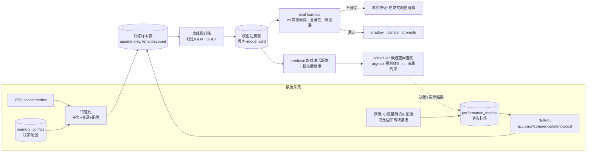

# ADR-0008: 自适应学习方法与 eval 方法论

## 决策信息

- 编号：ADR-0008
- 决策标题：把"自适应记忆调度"从**启发式 + 写死常量 + 死代码**改为**真学习闭环**——先以**离线批量拟合可解释模型**起步（明确特征 / 标签 / 数据管线），由**eval harness 证明自适应显著优于静态最优配置**后才放行；效果不达标则**诚实降级**为"启发式配置选择"；在线学习 / bandit 作为已验证后的演进项，不作为起点。
- 状态：Proposed
- 实现状态：未落地 —— 真学习闭环三件事（predictor 实测拟合 / scheduler 候选选优 / eval 门禁）均未落地：`TrainablePredictor` 只有 trait 声明无 impl、`monitor.rs:269` 仍写死 `response_time_ms:850`、scheduler 无候选比较；且放行前置本身失真——`eval_harness.rs:104-107` 硬编码 `passed:true`/`coherence:1.0`。须先把 eval harness 做真（backlog A-7）。
- 日期：2026-07-16（提出）；2026-08-11（按实现核实确认仍未落地）
- Owner：architect / ML engineer
- 收口责任人：待 tech-lead 主持 Design Review Board 收口（后续动作首项，仍 open）
- 关联：
  - `docs/artifacts/2026-07-16-enterprise-productionization/delivery-plan.md`（P3 阶段 + 放行标准："eval 证明自适应策略在离线基准上**显著优于**静态最优配置；predictor 置信度有真实依据；无写死常量喂决策"）
  - `docs/artifacts/2026-07-16-backend-serviceization-remediation/execute-log.md`（审查结论："自适应·自进化名实不符"）
  - `ADR-0003-memory-storage-operational-readiness.md`（运维就绪 gate）
  - OTel 可观测栈（commit `051d67f`，已真实接入，可作特征 / 标签来源）
- 取代 / 收口对象：
  - `services/predictor.rs` 写死 baselines（`:11-39`）+ 字面 `confidence_score: Some(0.88)`（`:88`）
  - `services/analyzer.rs` `calculate_confidence_score`（`:139-159`，恒≈1.0）
  - `services/monitor.rs` `response_time_ms = 850` 写死喂决策（`:47`）
  - `services/strategy_mutator.rs` 伪进化 + 零消费死产物（`:5-7`、`:241-263`、`:266`；P0 已停用）

---

## 实现核实与前置条件（2026-08-11 收口）

按代码核实，本 ADR 主张的真学习闭环（predictor 从实测拟合 → scheduler 候选选优 → eval 门禁）**尚未落地**，因此保持 `Proposed`。更关键的是：**本 ADR 自设的放行前置条件（eval harness 证明自适应 > 静态最优）本身尚不成立**——eval harness 是假的。

**核实证据（现状 = 未落地）：**

- **predictor 无训练、trait 只有声明**：`backend/src/services/predictor.rs:297-306` 的 `TrainablePredictor::{update_from_sample, fit_from_samples}` **只有 trait 声明，全仓无任何 `impl`**（`rg "impl TrainablePredictor" src/` 零命中）。predictor 仍是写死系数的闭式组合。
- **monitor 仍写死延迟喂决策**：`backend/src/services/monitor.rs:269` `response_time_ms: 850`——本 ADR 要修掉的伪造数仍在决策链上。
- **scheduler 未做候选比较**：`rg "argmax|candidate|archetype" src/services/scheduler.rs` 零命中；本 ADR「没有候选比较就不叫自适应选择」的要求未满足。
- **eval harness 前置条件是假的**：`backend/src/services/eval_harness.rs:104-107` 硬编码 `passed: true`、`actual_coherence: 1.0`、`duration_ms: 0`，从不真正调用 scheduler 对比静态最优。**本 ADR 依赖它证明「自适应显著优于静态最优」，但它当前无法证明任何东西**——放行前置本身失真。

**前置条件 / 阻塞原因（对应 backlog A-7；本 ADR 结论先行第 6 点自陈）：**

1. **先把 eval harness 做成真的**（backlog A-7 的第一步）：在 eval harness 能真实对比自适应 vs 静态最优、且无数据泄漏、可复现之前，P3 放行判定无法进行。
2. **需真 PG + 基准数据集 + 离线训练任务**：`training_samples` 表虽已建（`migrations/20260803000100_p3_training_samples.sql`，含 RLS），但特征/标签管线、全因子离线基准、离线批训练、模型注册表均未落地，需真环境与多轮实测，离线单会话不完成。
3. **标签独立性未切断自证**：本 ADR 硬要求标签来自独立测量（LLM-judge / oracle），且不得由 predictor 输出回填；该切断尚未实施。
4. **Design Review Board 尚未收口本 ADR**（后续动作首项仍 open）。

> 诚实收口口径：「自适应 / 自学习 / 自进化」是对外核心卖点，但实现是规则 + 常量 + 死代码。在本 ADR 落地或诚实降级前，保持 `Proposed` 并显式标注「尚未落地 + 前置条件失真」，与本 ADR「未经 eval 证明不得宣称自适应」的诚实性红线一致。

## 结论先行

1. **现状不是"学习"，是启发式 + 写死常量 + 死代码**。三条证据：
   - **predictor 无训练**：`PerformancePredictionModel::new()` 把 4 层 baseline（`stm.efficiency_gain = 0.2473` 等）和边际衰减（`0.495 / 0.470 / 0.071`）**写死为常量**（`predictor.rs:11-39`），预测是这些常量的闭式组合；置信度是字面 `0.88`（`:88`）。既不从数据拟合，也不更新。
   - **假特征喂决策**：analyzer 复杂度 = 字数 / 关键词命中（`analyzer.rs:47-68`），置信度恒≈1.0（`:139-159`，起点 0.5，三项各 +0.2/+0.15/+0.15 几乎必然触发）；monitor 的 `response_time_ms = 850` **写死**（`monitor.rs:47`）再进入 `calculate_cost_benefit_ratio`（`:117-135`）→ 影响 `LinearDecayStrategy` 权重。**决策链上游是伪造数**。
   - **进化是死代码**：`strategy_mutator` 自己注明"产出无任何消费方——scheduler / predictor 均不读取；`estimate_candidate_score` 也非实测拟合"（`:5-7`），候选评分是启发式代理规则（`:241-263`），扰动是 `subsec_nanos` 播种的 xorshift（`:266`），守护已在 `main.rs` 停用。
2. **要补的"真"= 三件事闭环**：(a) predictor 从**实测性能**拟合；(b) scheduler 用**真预测**在候选配置空间里选优（现状只构造单一配置、不做候选比较，见 `scheduler.rs:73-152`）；(c) 用**受控数据 + 在线更新**替换假 mutator。三者缺一，"自适应"都不成立。
3. **推荐路线：离线批量拟合可解释模型起步，eval 门禁把关，再演进在线**。理由：起步阶段样本少、可解释性 / 可审计是企业售卖硬要求、离线批训练天然契合"离线"约束；在线 / bandit 在没有"自适应确有增益"的证据前引入，只会放大风险且无法归因。
4. **eval 是 P3 的放行核心，不是附属**。必须证明"自适应 > **静态最优固定配置**"（最强诚实基线），且**统计显著、无数据泄漏、可复现**。达不到就**诚实降级**：产品文案去掉"自学习 / 自进化 / 自适应"，predictor 回退为静态最优或规则推荐并**如实标注置信度来源**（不再有 0.88 / ≈1.0）。
5. **关键陷阱（决定管线设计）：观测日志有选择偏差（off-policy confounding）**。生产只记录"当前策略选了哪个配置"，无法反事实回答"若换配置 X 会怎样"。因此训练 / eval 数据**必须引入探索**（小流量随机 / ε-配置分配）或用**全因子离线基准**（每个 任务 × 候选配置 都实测），不能只用观测日志拟合，否则学到的是"当前策略的影子"而非真规律。
6. **离线约束**：本 ADR 只出设计。落码需真 PG（样本表 / 模型注册表）、真基准数据集、离线训练任务与多轮实测，本会话不完成。

---

## 背景与约束

### 当前问题（名实不符的差异化卖点）

"自适应记忆调度"是 Aetheris-MemOS 对外核心卖点，但审查确认其实现是**规则 + 常量**，对企业买家构成"声明 > 实现"。P3 的目标是把它补成**可证明、可审计、可回退**的真学习系统，或在证据不足时**诚实降级**——两者都比"假装自适应"强。

### 业务目标

- 让配置选择由**实测性能**驱动，而非写死常量。
- 用**离线基准 + 统计检验**给出"自适应到底有没有用"的**可信答案**，作为 P3 放行 / 降级的唯一依据。
- 全链路**可解释、可审计、可回滚**（模型版本、特征、样本、评估报告均可追溯），满足企业内控。

### 约束

- **离线**：无外网；训练走离线批处理；本会话只出设计。
- **样本冷启动**：生产实测样本少且有选择偏差；需要探索机制 / 离线基准补齐。
- **可解释性优先**：企业售卖 + 内控要求，起步用可解释模型；黑盒模型需 ADR 单独论证。
- **不得循环 / 泄漏**：标签必须来自**独立测量**（LLM-judge / 任务成功信号 / `user_satisfaction`），**绝不能用 predictor 自己的输出当标签**（现 `performance_metrics.accuracy_score / coherence_score` 若被 predictor 数回填即构成自证，必须切断）。
- **既有资产可复用**：OTel 已接入（特征 / 延迟来源）；`performance_metrics` 表已有 `config_id ↔ accuracy_score / coherence_score / response_time_ms` 关联（`db/performance.rs:20-60`），是天然标签落点；`MemoryConfigRepository` 存了每次决策的配置。

### 非目标

- 不在 P3 起步就上在线学习 / 深度模型 / RL；作为演进位。
- 不追求"预测绝对准"，只需**预测排序足够好**以支持"选出更优配置"，并由 eval 证明。
- 不改记忆存储 / 检索本身的正确性（属 P1）；本 ADR 只管"如何选配置 + 如何证明选得更好"。
- 不定义 OTel span / metric 的具体埋点清单（属实现，落 execute-log）。

---

## 备选方案

按**学习范式**给四个选项（任务列举的 ①在线/bandit ②离线批量 ③简单回归/GBDT ④诚实启发式）；其中 ②与③可组合（②是"何时训练"，③是"用什么模型族"），故推荐 = ②+③ 起步、①演进、④兜底。

| 方案 | 适用条件 | 优点 | 风险 / 成本 | 取舍 |
|---|---|---|---|---|
| **① 在线学习 / contextual bandit**（Thompson / LinUCB） | 已有稳定奖励信号 + 足够探索流量 + 已证明自适应有增益 | 无需批训练即持续适应；探索/利用一体 | 冷启动差、奖励延迟难归因、易被噪声带偏、离线难复现、可解释 / 审计弱；**无增益证据前上线放大风险** | **不作起点**，留 P3d 演进 |
| **② 离线批量拟合（周期重训）** | 样本可积累、可离线跑批、需可复现与审计 | 训练 / 评估可完全离线复现；契合"离线"约束；版本化、可回滚、可审计 | 适应有滞后（按重训周期）；需样本管线与注册表 | **推荐（起点）** |
| **③ 简单回归 / GBDT 起步**（正则线性/GLM → GBDT） | 特征维度低、需可解释、样本量中等 | 线性/GLM 系数即"每层边际贡献"，直接替换写死 baseline 且可解释；GBDT 抗非线性 / 交互 | 线性欠拟合复杂交互；GBDT 解释性略弱、需防过拟合 | **推荐（起点模型族，与②组合）**：线性/GLM 打底，GBDT 作对照，取 eval 胜者 |
| **④ 保持启发式但诚实标注** | 上述都无法证明增益时 | 零 ML 风险、行为可预期、诚实 | 放弃"自适应"差异化卖点 | **强制兜底**：eval 不过则回落此项 |

### 推荐

**② + ③ 起步**：离线批量拟合一个**可解释模型**（正则线性 / GLM 打底，GBDT 作对照），配**明确的特征 / 标签 / 数据管线**；由 **eval harness 门禁**决定是否放行。**① 在线 / bandit** 仅在离线证明"自适应显著 > 静态最优"后，作为 P3d 演进引入，且仍受同一 eval 门禁约束。**④ 诚实启发式**为**强制兜底**：任一放行标准不满足即回落，并同步清理对外文案与伪造置信度。

**为什么不直接上①**：在"自适应是否有用"这个前置问题还没被证明时，在线学习既无法离线复现（违反约束 + 审计红线），又会因选择偏差 / 奖励噪声把系统带向不可归因的漂移——等于用更贵的方式重蹈 `strategy_mutator` 的覆辙。先用②+③把"有没有用"用数据钉死，再谈"如何持续适应"。

---

## 决策结果

### 采用：离线学习闭环（数据管线 → 拟合 → 候选选优 → eval 门禁 → 受控在线演进），诚实降级兜底

#### 1. 目标闭环（把三件"假"改真）

- **(a) predictor 从实测拟合**：`PerformancePredictionModel` 不再在 `new()` 写死常量，而是**加载注册表中的激活模型版本**；`predict_memory_performance` 用模型给出 `efficiency / coherence / latency / cost` 预测；置信度改为**校准区间**（见 §3.4），删除字面 `0.88`。
- **(b) scheduler 用真预测选优**：现状 `scheduler.rs:73-152` 只从启发式策略构造**单一**配置。改为：在**候选配置空间**（见 §3.3）上对每个候选用模型预测，选 `argmax(预测效用)`（效用 = 质量与成本 / 延迟的加权，受 `enforce_resource_constraints` 约束）。**没有候选比较，就不叫"自适应选择"**。
- **(c) 受控在线替换假 mutator**：`strategy_mutator` 的伪进化 / 零消费产物**删除**；在线适应（若 P3d 启用）改为在**已验证模型 + 探索日志**上做**受护栏的系数更新**（步长限幅、回滚阈值、影子先行），且 scheduler **真实消费**其产物。

#### 2. 数据管线（telemetry → 特征 → 标签 → 样本 → 训练 → 上线）

- **来源**：OTel（任务 / 资源 / 延迟 span+metric）、`performance_metrics`（真实结果）、`memory_configs`（决策配置）。
- **特征（features）**：
  - 任务特征：complexity、modality_count、temporal_scope、reasoning_depth、context_dependency——**但这些必须是可靠派生量**；当前 analyzer 的 wordcount/keyword 复杂度与恒≈1.0 置信度需先诚实化（要么改进，要么标注为弱特征，绝不当作"高置信"喂下游）。
  - 资源特征：CPU / 内存（sysinfo 真实）+ **真实延迟**（必须修掉 `monitor.rs:47` 的 850，改从 OTel 请求直方图 / 处理耗时取 p50/p95）。
  - 配置特征：`memory_weights{stm,ltm,kg,mm}`、primary/secondary 组合、reasoning_depth、enable_multimodal。
- **标签（labels，独立测量）**：accuracy / coherence（LLM-judge 或任务成功 oracle，**非** predictor 输出）、latency（p50/p95）、cost（资源占用折算）、可选 `user_satisfaction`。**标签来源与预测输入物理隔离**，切断自证回路。
- **样本存储**：新增 `training_samples` 表（`sample_id`、`tenant_id`、`task_id`、`config_id`、`features_json`、`labels_json`、`policy_tag`（是否探索样本）、`split_tag`（train/val/test）、`collected_at`），**append-only、租户隔离**（RLS，随 P1 基线）。
- **训练**：**离线批处理任务**（周期重训，如每日 / 每周）：读样本 → 切分（§4 防泄漏）→ 拟合（线性/GLM + GBDT 对照）→ 产出模型工件 + **model card**（特征、指标、数据窗口、局限）。
- **系数更新 / 上线**：写入**模型注册表**（`model_versions` 表：`version`、`artifact_uri`、`metrics_json`、`trained_at`、`status`(shadow/canary/active/rolled_back)）；predictor 加载 `active` 版本；上线走 **shadow（只预测不决策，比对）→ canary（小流量）→ promote**，异常一键回滚到上一 `active`。

#### 3. 关键设计点

- **3.1 探索 / 去偏（数据管线的地基）**：为避免 off-policy confounding，二选一或并用：(i) **全因子离线基准**——固定基准任务集 × 候选配置集，**每格实测**，得无偏 (任务,配置)→标签 表；(ii) **生产探索**——小流量按 ε 随机分配配置，`policy_tag` 标注，供无偏训练 / off-policy 评估。**纯观测日志不得作为唯一训练源**。
- **3.2 候选配置空间**：不做全空间穷举，用**配置原型集**（如 8–16 个 archetype：纯 STM / STM+LTM / STM+LTM+KG / 全开 等 × 若干权重档 × reasoning 档）。空间小、可全因子实测、可解释。
- **3.3 效用函数**：`utility = w_q·quality − w_l·norm(latency) − w_c·cost`，权重可按租户 SLA 配置；scheduler 选 `argmax utility` 且满足资源约束。效用定义**与 eval 主指标一致**，避免"优化 A、评估 B"。
- **3.4 置信度校准（放行标准"置信度有真实依据"）**：用 **conformal prediction** 或**残差经验分位数**给预测区间；报告校准曲线（predicted vs observed）。**删除** `predictor.rs:88` 的 `0.88` 与 `analyzer.rs:139-159` 的伪置信度。

#### 4. eval 方法论（P3 放行核心）

> 命题：**自适应策略在冻结离线基准上，按预注册主指标，显著优于静态最优固定配置，且无数据泄漏、可复现。**

- **基线（baselines）**——必须同时报告：
  1. **静态最优固定配置（primary bar）**：在基准上平均表现最好的**单一**固定配置。**这是要打败的对象**（"自适应"若打不过一个精心选的固定配置，就没有存在价值）。
  2. 当前启发式 scheduler（现状对照）。
  3. **Per-task oracle（上界）**：每个任务事后选最优配置——自适应应逼近它。
  4. 随机配置（下界 sanity check）。
- **基准集**：固定、版本化、**冻结**的代表性任务集，按 complexity / modality / reasoning 分层（stratified）；与训练集**按任务族 + 时间切分隔离**。
- **指标**：主 = 质量（accuracy/coherence 复合 或 任务成功率）；次 = latency p50/p95、cost、quality-per-cost；**分层报告**（避免总均值掩盖某类任务上的退化）。
- **评估协议**：因基准是全因子实测（§3.1-i），任何策略（含自适应)的**每个选择都有 ground-truth 标签**——直接可比，规避反事实缺标签问题；离线网格没覆盖的配置走线上 A/B / interleaving 补测。
- **统计显著性**：任务配对（同任务比不同策略）→ **Wilcoxon signed-rank**（非参配对）+ **bootstrap 95% CI** + 效应量；**预注册**主指标、最小可检测效应（MDE）与功效（所需任务数 n）；多分层比较用 **Holm-Bonferroni** 校正。报告 **win-rate（自适应 > 静态最优的任务占比）+ 中位提升 + CI**。
- **防过拟合 / 防泄漏（硬要求）**：
  - **时间切分**：早期样本训练、晚期测试，杜绝 look-ahead。
  - **分组切分**：按任务族 / 租户切，防近重复样本跨集泄漏。
  - **测试集冻结**：只评一次，禁止照着测试集调参（调参在 train/val，k-fold CV）。
  - **标签独立**：标签不得由模型输出派生（切断自证）。
  - **特征泄漏审计**：禁止把"用结果算出来的量"当特征。
  - **选择偏差**：训练 / 评估用探索或全因子数据，不用被旧策略污染的观测日志。
- **eval harness 设计**：版本化数据集 + 配置网格 + 指标定义 + 固定随机种子 → 产出**评估报告工件**（win-rate / CI / 分层表 / 校准曲线 / model card），**离线可复现**，纳入 CI 作为 P3 门禁。
- **放行判定**：主指标上"自适应 > 静态最优"**统计显著**（预注册阈值，如 win-rate 下界 CI > 50% 且中位提升 ≥ MDE）+ 无泄漏审计通过 + 报告可复现 → **通过**；否则 → **诚实降级**。

#### 5. 诚实降级路径（放行标准不满足时）

- **产品 / 文案**：移除"自学习 / 自进化 / 自适应"表述（含 `agent-card`、`CLAUDE.md`、API 文档），改为"**基于遥测的规则化配置推荐**"。
- **predictor**：回退为**静态最优配置**（eval 已给出）或诚实规则；置信度**如实标注来源**或直接不返回，**不得**再出现 `0.88` / ≈1.0。
- **保留管线与 harness**：继续积累探索样本，为下一次尝试留数据；每积累到功效所需样本量即重跑门禁——**降级是可逆的**。
- **诚实优先于卖点**：宁可少一个卖点，不可留一个假卖点（企业内控红线）。

### 影响范围

- `backend/src/services/predictor.rs`：去写死常量 / `0.88`；改加载注册表模型 + 校准置信度。
- `backend/src/services/scheduler.rs`：`adaptive_memory_selection` 增加**候选配置空间上的模型选优**（`:73-152` 从"构造单配置"改"选优"）。
- `backend/src/services/monitor.rs`：修掉 `response_time_ms = 850`（`:47`），改真实延迟来源。
- `backend/src/services/analyzer.rs`：诚实化 `calculate_confidence_score`（`:139-159`），弱特征如实标注。
- `backend/src/services/strategy_mutator.rs`：**删除**（伪进化 + 零消费）；在线适应（若启用）在新模块以受护栏方式重建。
- `backend/src/services/weight_strategy.rs` / `weight_adjuster.rs`：规则策略保留为**特征 / 兜底**，但不再冒充"学习"；写死阈值可作为待学习参数或诚实规则。
- 新增迁移：`training_samples`、`model_versions` 表（tenant-scoped，RLS）。
- 新增：离线训练批任务、eval harness（数据集 + 报告工件）、探索开关（ε 配置分配）。
- 标签管线：`performance_metrics.accuracy_score / coherence_score` 的**写入源**必须切换到独立测量（LLM-judge / oracle / 满意度），并审计现有写入是否曾被 predictor 数污染。

### 兼容性 / 迁移影响

- **API 形状兼容**：`/api/v1/memory/select`、`predict_performance`、`adjust_weights`、决策轨迹字段不变；**语义从"常量闭式"变"模型预测"**，`confidence_score` 从字面值变校准值。
- **单实例 / 冷启动优雅退化**：无模型 / 样本不足时，predictor 回落静态最优或诚实规则（等价降级路径），系统仍可用。
- **决策轨迹（DecisionTrace）**：应补充"用了哪个模型版本 + 预测区间 + 候选比较"以支撑可审计，前端 `MemoryDecisionTrace` 可渐进增强（非阻塞）。

### 失败 / 回退

- **模型上线异常**：shadow / canary 比对退化 → 自动回滚上一 `active` 版本。
- **eval 不通过**：走 §5 诚实降级；harness 与样本管线保留，可重试。
- **探索影响体验**：ε 设小、按租户可关；探索样本单独标注不污染生产 SLA 归因。
- **样本不足 / 漂移**：门禁按功效样本量把关，不足即不放行；监控特征 / 标签分布漂移，触发重训或降级。

---

## 企业内控补充

- **应用等级**：自适应决策影响记忆配置与资源成本，按 T2/T3 口径；模型上线纳入变更管控（版本、审批、回滚）。
- **技术架构等级**：模型版本、训练数据窗口、eval 报告、置信度校准均须**可追溯、可审计**；上线走 shadow→canary→promote 并有监控告警（预测漂移、校准退化、win-rate 回归）。
- **关键组件偏离**：起步用可解释模型（线性/GLM/GBDT），优先复用现有 PG（样本 / 注册表）+ OTel（特征）；若引入外部 ML 训练框架 / 特征平台 / 黑盒模型，需在此登记原因、运维归属、可解释性补偿与退场路径。
- **数据合规**：训练样本含任务内容派生特征，须租户隔离（RLS）、脱敏、遵循数据保留策略；标签若用 LLM-judge，需记录裁判模型版本与提示，纳入可复现。
- **诚实性红线**：未经 eval 证明，不得对外宣称"自适应 / 自学习 / 自进化"；伪造置信度（0.88 / ≈1.0）视为对外失实，必须清除。
- **资产文档入口**：本 ADR、delivery-plan（P3）、eval 报告工件、model card、后续 P3 test-plan 与 deployment-context。

---

## 后续动作

| 动作 | Owner | 完成条件 |
|---|---|---|
| Design Review Board 收口本 ADR（含与 P1 标签源 / RLS 边界确认） | tech-lead / architect | Proposed→Accepted |
| **P3a** 遥测→特征→标签管线 + `training_samples` 表 + 探索开关（ε 配置分配） | backend + architect | 样本可无偏落库（含 `policy_tag`）；标签源独立于 predictor；RLS 通过 |
| **P3a** 修真实延迟（去 `monitor.rs:47` 的 850）+ 诚实化 analyzer 置信度 | backend | 决策链无写死常量 / 伪置信度；延迟取自 OTel |
| **P3b** 全因子离线基准数据集（任务分层 × 配置原型，冻结版本化） | qa + backend | 基准可复现；train/test 时间+分组切分隔离 |
| **P3b** 离线批训练（线性/GLM + GBDT 对照）+ 模型注册表 + model card | backend + architect | 产出版本化模型 + 校准置信度；训练可离线复现 |
| **P3c** scheduler 候选空间选优 + predictor 加载模型（替换写死常量） | backend | scheduler 真做候选比较；predictor 无 `0.88` |
| **P3c** eval harness（vs 静态最优 · Wilcoxon+bootstrap · 防泄漏审计） | qa + backend | 报告工件产出；进 CI 作 P3 门禁 |
| **P3c** 放行 / 降级裁决 | tech-lead / qa | 显著优于静态最优→放行；否则执行 §5 诚实降级 + 清理文案 |
| 删除 `strategy_mutator` 死产物；（若放行后）P3d 受护栏在线更新 | backend | 死代码移除；在线层被 scheduler 真实消费且受回滚护栏 |
| shadow→canary→promote 上线 + 漂移 / 校准监控告警 | backend + devops | 灰度可回滚；监控项就位 |
