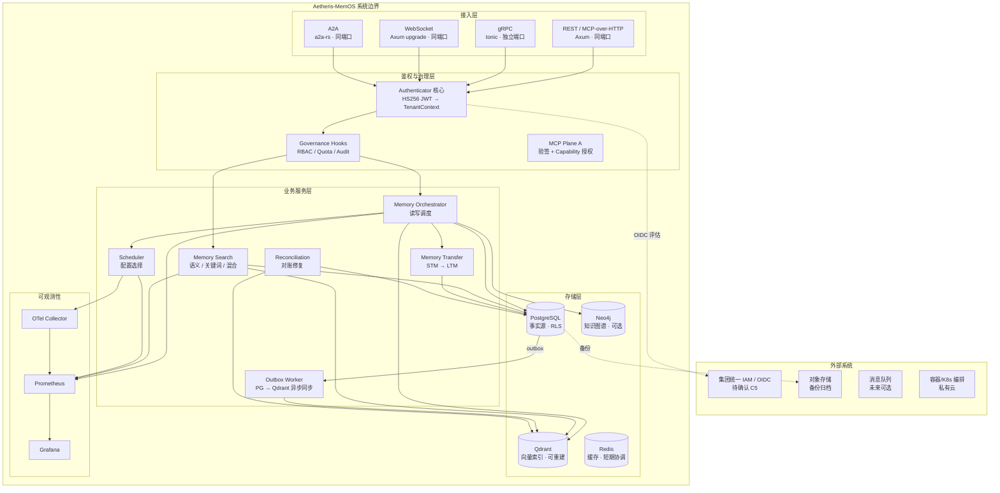
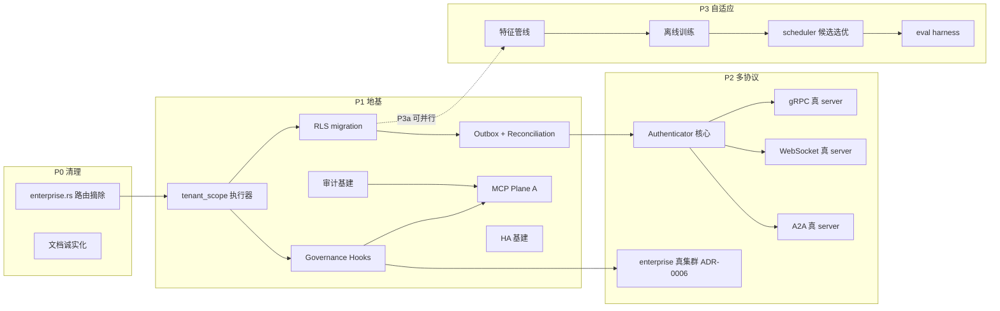
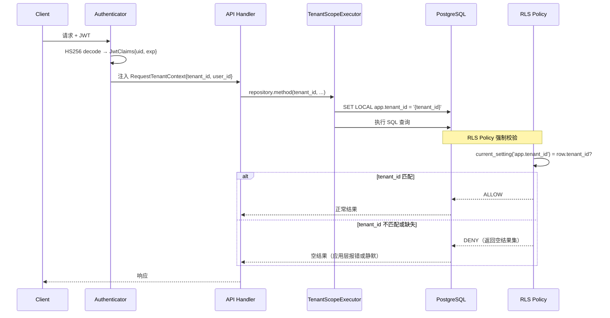
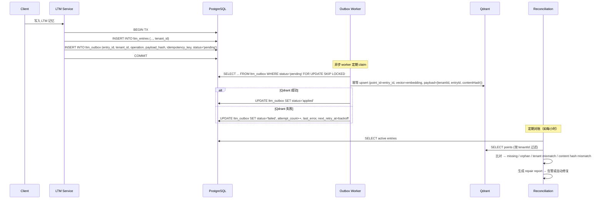
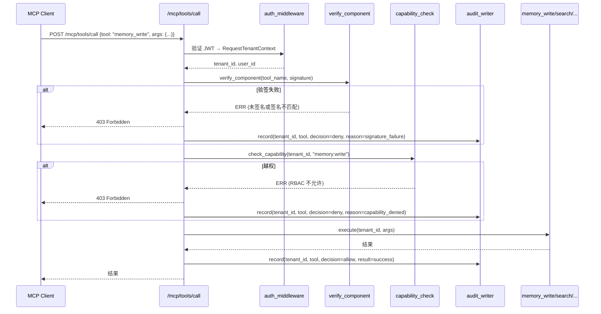
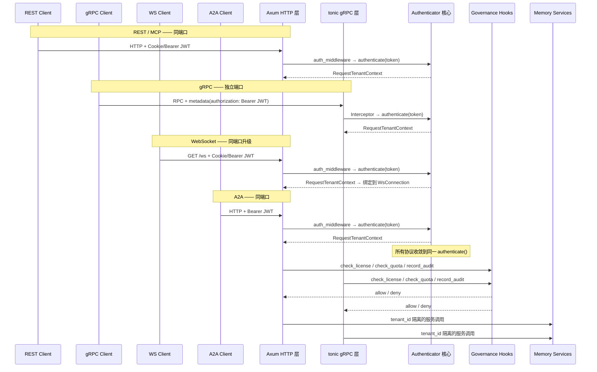
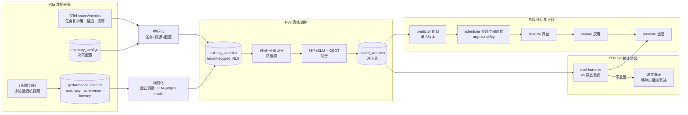
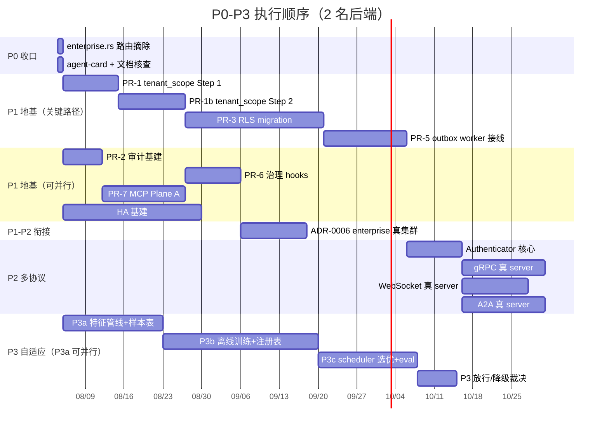

# Architecture Design — Aetheris-MemOS 架构修复全线推进（P0–P3）

- **日期**：2026-08-03
- **主责角色**：architect
- **状态**：Design Review 待审
- **关联 PRD**：`docs/artifacts/2026-08-03-architecture-remediation-full/prd.md`
- **关联 Delivery Plan**：`docs/artifacts/2026-08-03-architecture-remediation-full/delivery-plan.md`
- **关联 ADR**：ADR-0001 ~ ADR-0008（`docs/adr/`）

---

## 0. 上游质疑记录

> 依据 `rules/handoff-contract.md` 要求，architect 作为接收方必须对上游输入提出质疑。

### 质疑 1：P0→P1 严格串行的约束是否在架构层面可接受？

- **质疑内容**：Delivery Plan 规定 P0→P1→P2→P3 严格串行，但同时说"P3a（基准集+特征管线）可与 P1 并行起步"。从架构视角看，P3a 的 `training_samples` 表需要 RLS（P1 PR-3 的产出），OTel 特征管线依赖 `tenant_scope` 执行器（P1 PR-1）的正确性以保证采集的延迟数据反映真实隔离路径。如果 P3a 与 P1 并行，P3a 的数据采集和表结构必须基于 P1 的中间态设计——这意味着 P3a 的架构契约在 P1 完成前就会被"锁定"，如果 P1 的 RLS 设计变化，P3a 的表结构和采集管线也需要跟着变。
- **质疑目标**：Delivery Plan 的"P3a 可与 P1 并行"与"P1 是地基"之间的矛盾
- **结论**：**接受原方案，但需架构防护**
- **处理说明**：
  - P3a 的 OTel 采集（span、metric）不依赖 RLS——它采集的是应用层延迟和资源指标，这些数据在 P1 RLS 上线前就有意义。
  - P3a 的 `training_samples` 表可以**先创建、先采集、先做 schema**，RLS 策略在 P1 PR-3 完成后补加——这是 ADR-0001 expand→backfill→enforce 模式的自然延伸。
  - **架构防护**：P3a 的表设计必须预留 `tenant_id` 列（NOT NULL），并在 P1 RLS enforce 前通过应用层 TenantId 强制隔离（ADR-0001 中间态），不依赖纯 prefix 隔离。
  - **结论**：并行是可行的，但 P3a 的架构契约必须与 P1 的 RLS 方向一致（三层隔离模型），不允许 P3a 绕过 tenant_id 走捷径。

### 质疑 2：enterprise.rs 假集群摘除后，ADR-0006 的"真集群"何时实现？P0 和 P2 之间是否存在"能力真空期"？

- **质疑内容**：D1 决策"enterprise.rs 假集群从路由摘除但保留文件（P2 做真复用）"。ADR-0006 给出了 PG advisory lock + cluster_nodes 表 + 一致性哈希的真实现方案，但 Delivery Plan 将 ADR-0006 的落地放在了"未明确阶段"（不在 P0-P3 的任何 PR 中）。这意味着 P0 摘除路由后，enterprise 端点会从"返回假数据"变为"404 Not Found"——直到 P2 某个时间点才恢复。这期间企业买家如果尝试这些端点，会发现能力从"看起来有"变成了"确认没有"。
- **质疑目标**：P0 摘除与 ADR-0006 真实现之间的时间窗口是否可接受
- **结论**：**接受原方案**
- **处理说明**：
  - "看起来有但实际是假的"比"确认没有"更损害信任——这是 D1 的核心论据，我认同。
  - ADR-0006 的真实现依赖 P1 的 PG 基建（advisory lock、迁移基础设施）和治理 hooks——它自然属于 P1 后期或 P2 早期。
  - **架构决策**：ADR-0006 的落地时机定为 **P1 末期（PR-6 治理 hooks 之后、P2 开始之前）**——此时 PG 基建已就绪、治理 hooks 已接入，真集群实现可以在 P1 放行前完成。如果资源不足，可推迟到 P2 早期，但必须在 P2 多协议端点对外暴露之前完成（否则企业集群端点缺失会成为技术尽调的阻塞项）。
  - **架构约束**：P0 摘除时必须在 API 文档和 agent-card 中**如实标注**"enterprise cluster endpoints are under development (ADR-0006)"，不留下"404 无解释"的真空。

### 质疑 3：2 名后端 + 6-12 个月的时间约束下，P1 的 7-10 周关键路径是否已包含足够的缓冲？

- **质疑内容**：P1 关键路径 = PR-1（tenant_scope 执行器，1-1.5wk）→ PR-1b（逐 repository 接入，1.5-2wk）→ PR-3（RLS migration，3-4wk）→ PR-5（outbox worker，2-3wk），合计 7-10 周。但 PR-3 的 RLS migration 涉及"expand→backfill→enforce"三阶段，每个阶段都需要在真实 PG 上验证——backfill 阶段如果数据量大（生产有历史数据），可能需要额外时间。同时 PR-1b 的"逐 repository 接入"涉及 `stm.rs`、`ltm.rs`、`kg.rs`、`mm.rs`、`performance.rs`、`weights.rs`、`decision_trace.rs`、`audit.rs`、`vector_outbox.rs` 共 9 个 repository 文件的改造，每个文件的查询路径都需要逐一检查。在 2 名后端的情况下，7-10 周的估算偏乐观。
- **质疑目标**：P1 关键路径的时间估算是否可信
- **结论**：**要求补充**——需要在 Delivery Plan 中增加 PR 级别的缓冲时间和风险触发点
- **处理说明**：
  - 从架构视角，我无法缩短 PR-3 的 RLS migration 复杂度——它是 P1 安全底线的核心，任何捷径都会留下跨租户泄露风险。
  - **建议缓冲**：关键路径增加 30% 缓冲 = 9-13 周（含缓冲）。PR-1/PR-1b 有并行空间（2 名后端可分工：一人做执行器逻辑、一人做审计基建 PR-2），但 PR-3 和 PR-5 必须串行。
  - **风险触发点**：PR-1b 完成时（约第 4 周）做一次进度检查——如果 PR-1b 超期 >1 周，需要 tech-lead 裁决是否缩减 PR-3 范围（如先对核心 3 个 repository 做 RLS enforce，其余标记为 P1 遗留）。
  - **架构约束**：RLS enforce 必须覆盖的**最低集合** = `stm`、`ltm`、`kg`、`mm`、`vector_outbox`（核心记忆链路），其余 repository 可在 P1 放行后 2 周内补齐。

---

## 1. 系统边界

### 1.1 外部依赖与集成点



### 1.2 边界内外划分

| 层次 | 边界内（本系统负责） | 边界外（外部/托管） |
|------|---------------------|---------------------|
| **接入层** | REST/MCP/gRPC/WS/A2A 端点、TLS、鉴权适配 | K8s Ingress / LoadBalancer（流量入口） |
| **鉴权** | Authenticator 核心、JWT 解码、TenantContext 注入、Governance hooks | 集团 IAM / OIDC（待确认 C5）、密钥管理 |
| **业务服务** | Scheduler、Orchestrator、Search、Transfer、Outbox、Reconciliation | — |
| **关系存储** | Migration、RLS 策略、查询逻辑 | 托管 PostgreSQL（Multi-AZ + PITR）|
| **向量存储** | Qdrant client、payload 校验、rebuild 逻辑 | 托管 Qdrant Cloud（RF ≥ 2）|
| **图存储** | Neo4j driver、Cypher 查询 | 托管 Neo4j Aura（待关键路径复核）|
| **缓存** | Redis client 配置 | Redis 实例（托管或 operator）|
| **HA/备份** | 配置、演练 runbook、告警规则 | 托管 Multi-AZ、自动备份、PITR |
| **可观测** | OTel span/metric 埋点、Prometheus exporter | OTel Collector、Prometheus、Grafana（运维栈）|

### 1.3 关键边界约束

1. **数据事实源单一性**：PostgreSQL 是所有 memory-owned relational fact 的唯一事实源（ADR-0001/0002）。Qdrant 和 Neo4j 是可重建索引，不承担不可恢复数据。
2. **不自建分布式底座**：禁止自写 Raft/Paxos/复制/分片（ADR-0005/0006）。HA 由托管基建承接，应用层协调用 PG advisory lock。
3. **鉴权单一事实源**：四协议（REST/MCP/gRPC/WS/A2A）共享同一 `Authenticator` 核心（ADR-0007），不允许各协议自行实现鉴权。
4. **MCP 双平面隔离**：第一方工具走 Plane A（验签+授权+审计），不可信工具走 Plane B（wasmtime 真沙箱）（ADR-0004）。两者不得混淆。

---

## 2. 组件拆分（P0–P3 各阶段）

### 2.1 全局组件视图



### 2.2 P0 收口——声明一致性清理

| 组件 | 当前状态 | P0 目标 | 改动范围 |
|------|----------|---------|----------|
| `routers/enterprise.rs` | 9 个活端点返回假集群数据 | **从 `routers/mod.rs` 摘除路由注册**；保留文件和 `mod` 声明（P2 做真复用） | `routers/mod.rs`（删路由块）、API 文档、agent-card |
| `a2a/agent_card.rs` | streaming/skills 声明可能与实测不符 | 核查并修正声明 | `agent_card.rs`、CLAUDE.md |
| CLAUDE.md / API 文档 | 存在"声明>实现"表述 | 修正为如实描述 | 文档文件 |

### 2.3 P1 地基——安全与可靠性基础设施

#### 2.3.1 tenant_scope 执行器（PR-1 / PR-1b）

| 组件 | 文件 | 职责 |
|------|------|------|
| `TenantScopeExecutor` | `db/tenant_scope.rs`（新建或扩展） | 在每次 DB 请求前注入 `SET LOCAL app.tenant_id = $1`；提供 `with_tenant()` 作用域方法 |
| Repository 适配 | `db/stm.rs`, `db/ltm.rs`, `db/kg.rs`, `db/mm.rs`, `db/performance.rs`, `db/weights.rs`, `db/decision_trace.rs`, `db/audit.rs`, `db/vector_outbox.rs` | 每个 repository 方法从 `&self` + 隐式 tenant 改为接收 `TenantId` 参数，内部调用 `with_tenant()` |

**架构约束**：
- PR-1（Step 1）：`TenantScopeExecutor` 纯逻辑 + 单测，不改动任何 repository。
- PR-1b（Step 2）：逐 repository 接入。优先级：`stm` → `ltm` → `vector_outbox` → `kg` → `mm` → 其余。
- 每个 repository 改造后必须有对应的**跨租户负向测试**（用不同 tenant_id 查询，验证 RLS 拒绝）。

#### 2.3.2 RLS Migration（PR-3）

| 阶段 | 操作 | 回滚策略 |
|------|------|----------|
| **Expand** | 为所有 memory-owned tables 添加 `tenant_id` 列（nullable）；创建 RLS policy（DISABLED） | DROP 列 |
| **Backfill** | 从 `source_id`/`user_id` 的 `t:{tenant}` 前缀提取 tenant_id 填充；无法归属的进入 quarantine | 清空填充列 |
| **Enforce** | `ALTER TABLE ... ENABLE ROW LEVEL SECURITY`；`tenant_id SET NOT NULL`；`SET LOCAL app.tenant_id` 未设置时 DENY | DISABLE RLS + 恢复 nullable |

**受影响的表**（最低集合）：
- `stm_sessions`, `stm_entries`
- `ltm_entries`, `ltm_metadata`, `ltm_history`
- `kg_entities`, `kg_relations`
- `mm_entries`
- `memory_audit_events`
- `ltm_outbox` (vector_outbox)
- `performance_metrics`, `weight_history`, `decision_traces`

#### 2.3.3 Outbox Worker + Reconciliation（PR-5）

| 组件 | 文件 | 职责 |
|------|------|------|
| Outbox Worker | `services/outbox_worker.rs`（已有，需接线） | Claim pending events → Qdrant 幂等 upsert/delete → mark applied |
| Reconciliation | `services/vector_reconciliation.rs`（已有，需接线） | 定期比对 PG active entries vs Qdrant points → 生成 repair report |
| Outbox Schema | `db/vector_outbox.rs`（已有） | `ltm_outbox` 表：claim/mark/reclaim 状态机 |

**架构约束**：
- Outbox event 的写入**必须在 LTM 写入的同一 DB transaction 内**（ADR-0002），否则崩溃时会丢失事件。
- Qdrant payload 必须包含 `tenantId`、`entryId`、`contentHash`——用于对账校验。
- Worker 失败超过阈值 → dead-letter + 告警，不丢数据。

#### 2.3.4 治理 Hooks（PR-6）

| 组件 | 文件 | 职责 |
|------|------|------|
| Governance Middleware | `hoops/governance.rs`（已有） | 请求中间件：classify → pre-hook → RBAC/Quota/Audit |
| Enterprise Hooks | `hoops/enterprise_impl.rs`, `hoops/enterprise_hooks_v2.rs`（已有） | RBAC 校验、配额计数、审计事件写入 |
| Audit Writer | `services/audit_writer.rs`（已有） | mpsc → batch INSERT 到 `memory_audit_events` |

**架构约束**：
- Governance hooks 必须在 **Authenticator 之后、业务 handler 之前**执行。
- 配额 `used` 的 increment 必须与请求成功绑定（成功才计数），失败不扣减。
- 审计事件必须包含 `tenant_id`、`tool/endpoint`、`decision`（allow/deny）、`timestamp`。

#### 2.3.5 MCP Plane A（PR-7）

| 组件 | 文件 | 职责 |
|------|------|------|
| call_tool 验签 | `routers/mcp.rs`（改造） | 调用 `verify_component` 校验工具签名，未签/失败拒绝 |
| Capability 授权 | `mcp/capability.rs`（扩展） | 5 个记忆工具的 capability/scope 映射 + RBAC 校验 |
| 审计接线 | `routers/mcp.rs` | 每次 call_tool 记录 `execution_id / tenant_id / tool / decision` |
| Mock 沙箱清理 | `mcp/sandbox.rs`, `mcp/sandbox_proxy.rs` | 删除或 feature-gate mock `execute_wasm` |

**5 个记忆工具的 Capability 映射**：

| 工具名 | Capability | 说明 |
|--------|-----------|------|
| `memory_write` | `memory:write` | 写入 STM/LTM |
| `memory_search` | `memory:read` | 语义/关键词搜索 |
| `memory_recall` | `memory:read` | 按 ID 召回 |
| `memory_forget` | `memory:delete` | 删除记忆 |
| `memory_list` | `memory:read` | 列举记忆 |

#### 2.3.6 HA 基建（全程并行）

| 存储 | 首选方案 | 合规回落 | RPO/RTO 目标 |
|------|----------|----------|-------------|
| PostgreSQL | 托管 DBaaS + Multi-AZ + PITR | CloudNativePG operator | RPO ≤ 5min, RTO ≤ 15min |
| Qdrant | 托管 Qdrant Cloud, RF ≥ 2 | K8s operator 集群 | RPO ≤ 24h（快照）, RTO ≤ 15min |
| Neo4j | 托管 Aura（Business Critical） | 自管 Enterprise 因果集群 | RPO ≤ 1h, RTO ≤ 30-60min |

**架构约束**：
- 选型闸门：pgvector 扩展支持（PG）、APOC 兼容性（Neo4j）、区域/数据驻留（Qdrant Cloud）。
- 恢复演练必须在 P1 放行前完成（ADR-0003），包括 PG PITR restore、Qdrant snapshot restore 或 DB rebuild、Neo4j dump/load。
- HA 告警项：replica lag、failover event、backup age、snapshot age、cluster health、PITR window。

### 2.4 P2 多协议——传输真实化与统一鉴权

#### 2.4.1 Authenticator 核心

| 组件 | 文件 | 职责 |
|------|------|------|
| `authenticate()` | `hoops/jwt.rs`（抽取） | 传输无关：`raw_token → HS256 decode → JwtClaims → RequestTenantContext` |
| REST/MCP 适配 | `hoops/jwt.rs`（改造为薄适配器） | 委托 `authenticate()`，行为不回归 |
| `web/jwt.rs` 合并 | `web/jwt.rs`（retire） | 消除双 JWT 漂移；query-string token 支持移除（灰度：先告警再拒绝） |

#### 2.4.2 三协议真实化

| 协议 | 传输选型 | 鉴权方式 | 端口 |
|------|----------|----------|------|
| gRPC | tonic（已在依赖树） | Interceptor 从 metadata 取 Bearer → `authenticate()` | 独立 HTTP/2 端口 |
| WebSocket | axum `WebSocketUpgrade`（零新依赖） | 握手期过 `auth_middleware` → 连接期绑定 TenantContext + 最大 TTL | 同 Axum 端口 |
| A2A | a2a-rs（需联网 pin rev） | HTTP middleware → `authenticate()` + agent 身份映射 | 同 Axum 端口 |

**架构约束**：
- gRPC service impl **委托 REST 同款 memory 服务/repository**，不另写业务逻辑。
- WS `send_to_session` 必须**按 tenant 过滤**，终结当前占位实现。
- A2A handler 从假数据改为**调真 memory 服务**，agent-card 声明与实测一致。
- 四协议全部接 ADR-0006 governance hooks（license/quota/audit）。

#### 2.4.3 Enterprise 真集群（ADR-0006）

| 组件 | 实现方式 |
|------|----------|
| Leader 选举 | `pg_try_advisory_lock(LEADER_LOCK_KEY)` |
| 集群成员 | `cluster_nodes` 表 + 心跳（30s TTL） |
| 分片路由 | 一致性哈希 over 活节点 + `memory_shards` 持久化 owner 映射 |
| 许可分级 | `tenant_licenses` 表 + governance hooks 中按 tier 门控 |

### 2.5 P3 自适应——配置推荐与评估

#### 2.5.1 数据管线（P3a）

| 组件 | 文件 | 职责 |
|------|------|------|
| 特征管线 | `services/feature_pipeline.rs`（已有，需改造） | OTel span/metric → 任务特征 + 资源特征 + 配置特征 |
| Monitor 诚实化 | `services/monitor.rs` | 修复 `response_time_ms = 850` 写死常量，改从 OTel 取真实延迟 |
| Analyzer 诚实化 | `services/analyzer.rs` | `calculate_confidence_score` 恒≈1.0 → 如实标注弱特征 |
| `training_samples` 表 | 新增迁移 | append-only, tenant-scoped（RLS），含 `policy_tag`（探索标记） |

#### 2.5.2 训练与模型（P3b）

| 组件 | 文件 | 职责 |
|------|------|------|
| 离线批训练 | 新增批处理任务 | 读样本 → 切分（时间+分组）→ 拟合（线性/GLM + GBDT）→ model card |
| 模型注册表 | `model_versions` 表 | 版本、artifact_uri、metrics、status（shadow/canary/active/rolled_back） |
| Predictor 改造 | `services/predictor.rs` | 去写死常量/0.88 → 加载注册表激活版本 + 校准置信度 |

#### 2.5.3 Scheduler 选优与 Eval（P3c）

| 组件 | 文件 | 职责 |
|------|------|------|
| Scheduler 改造 | `services/scheduler.rs` | 从"构造单配置"改为"候选配置空间上的模型选优（argmax 预测效用）" |
| Eval harness | `services/eval_harness.rs`（已有，需改造） | vs 静态最优 · Wilcoxon + bootstrap · 防泄漏审计 · 报告工件 |
| 降级路径 | 全局 | eval 不通过 → 诚实降级：移除"自适应"表述，predictor 回退静态最优 |

---

## 3. 关键数据流

### 3.1 tenant_scope + RLS 数据流（P1 核心）



### 3.2 Outbox + Qdrant 同步数据流（P1 核心）



### 3.3 MCP Plane A 鉴权 + 授权数据流（P1 核心）



### 3.4 跨协议统一鉴权数据流（P2 核心）



### 3.5 P3 自适应数据流（P3 核心）



---

## 4. 接口约定

### 4.1 现有 REST API（P0 清理后保持不变）

| Method | Endpoint | Auth | 描述 |
|--------|----------|------|------|
| GET | `/api/v1/memory/search/ltm` | JWT | 列举 LTM 条目 |
| POST | `/api/v1/memory/search/ltm` | JWT | 语义搜索 LTM |
| GET | `/api/kg/entities` | JWT | 列举 KG 实体 |
| GET | `/api/mm/list` | JWT | 列举多模态条目 |
| GET | `/api/v1/memory/storage/sessions` | JWT | 列举 STM 会话 |
| POST | `/mcp/tools/call` | JWT + 验签 + Capability | MCP 工具调用（P1 增加验签+授权） |
| GET | `/api/v1/health` | 无 | 系统健康检查 |
| GET | `/api/v1/health/liveness` | 无 | Liveness 探针 |
| GET | `/api/v1/health/readiness` | 无 | Readiness 探针 |

### 4.2 P1 新增/修改接口

| Method | Endpoint | Auth | 描述 |
|--------|----------|------|------|
| GET | `/api/v1/distributed/epoch/status` | JWT | Epoch 状态（governance hooks 接入） |
| GET | `/api/v1/distributed/pool/status` | JWT | 子代理池状态 |
| POST | `/api/v1/distributed/pool/allocate` | JWT | 分配子代理槽位 |
| POST | `/api/v1/distributed/pool/release` | JWT | 释放子代理槽位 |
| GET | `/api/v1/tenant/context` | JWT | 获取当前租户上下文 |
| GET | `/api/v1/tenant/quota` | JWT | 获取配额状态 |
| POST | `/api/v1/tenant/quota/reset` | JWT | 重置配额计数器 |

### 4.3 P2 新增接口

| 协议 | Endpoint/Service | Auth | 描述 |
|------|-----------------|------|------|
| gRPC | `MemoryService/Search`, `/Store`, `/Transfer`, `/Forget` | metadata Bearer JWT | gRPC 记忆操作（与 REST 同款逻辑） |
| WebSocket | `GET /ws` (upgrade) | Cookie/Bearer JWT (握手期) | 实时订阅/推送记忆事件 |
| A2A | `POST /a2a/messages`, `GET /a2a/messages/stream` | Bearer JWT | A2A 记忆操作 + 流式 |
| REST | `/api/v1/memory/enterprise/cluster/*` | JWT + License Tier | 集群状态（ADR-0006 真实现） |
| REST | `/api/v1/memory/enterprise/shards/*` | JWT + License Tier | 分片管理（ADR-0006 真实现） |

### 4.4 认证与授权协议

| 层次 | 机制 | 细节 |
|------|------|------|
| **传输层** | TLS 1.2+ | REST/gRPC/WS/A2A 全链路 TLS |
| **认证** | HS256 JWT | `JwtClaims{uid, exp}`；来源：httpOnly cookie 或 `Authorization: Bearer` header；**拒绝 query-string token** |
| **租户隔离** | `RequestTenantContext{tenant_id, user_id}` | 注入 request extensions；所有 handler/repository 必须消费 |
| **DB 层隔离** | PostgreSQL RLS | `SET LOCAL app.tenant_id` → RLS policy 校验 `current_setting('app.tenant_id') = row.tenant_id` |
| **MCP 工具授权** | Capability + RBAC | 工具 → capability 映射 → 租户 RBAC 校验 → 越权拒绝 |
| **治理** | License Tier + Quota | `tenant_licenses` 表 → 功能门控 + 配额上限 |

### 4.5 数据契约（关键 Schema）

#### RLS 核心字段（所有 memory-owned tables）

```sql
-- 每张 memory-owned table 必须包含
ALTER TABLE {table} ADD COLUMN IF NOT EXISTS tenant_id UUID;
-- Backfill 完成后
ALTER TABLE {table} ALTER COLUMN tenant_id SET NOT NULL;
-- RLS enforce
ALTER TABLE {table} ENABLE ROW LEVEL SECURITY;
CREATE POLICY tenant_isolation ON {table}
  USING (tenant_id = current_setting('app.tenant_id')::uuid);
```

#### Outbox 事件契约

```sql
CREATE TABLE ltm_outbox (
    id           BIGSERIAL PRIMARY KEY,
    tenant_id    UUID NOT NULL,
    entry_id     UUID NOT NULL,
    operation    TEXT NOT NULL,           -- 'upsert' | 'delete'
    payload_hash TEXT NOT NULL,           -- 内容 hash 用于幂等
    idempotency_key UUID NOT NULL UNIQUE,
    status       TEXT NOT NULL DEFAULT 'pending',  -- pending | claimed | applied | failed
    attempt_count INT NOT NULL DEFAULT 0,
    next_retry_at TIMESTAMPTZ,
    last_error    TEXT,
    created_at   TIMESTAMPTZ NOT NULL DEFAULT now(),
    updated_at   TIMESTAMPTZ NOT NULL DEFAULT now()
);
-- RLS
ALTER TABLE ltm_outbox ENABLE ROW LEVEL SECURITY;
CREATE POLICY tenant_isolation ON ltm_outbox
  USING (tenant_id = current_setting('app.tenant_id')::uuid);
```

#### 模型注册表（P3）

```sql
CREATE TABLE model_versions (
    version      TEXT PRIMARY KEY,
    tenant_id    UUID,                   -- NULL = 全局模型
    artifact_uri TEXT NOT NULL,
    metrics_json JSONB NOT NULL,         -- win-rate, CI, calibration 等
    trained_at   TIMESTAMPTZ NOT NULL,
    status       TEXT NOT NULL DEFAULT 'shadow',  -- shadow | canary | active | rolled_back
    model_card   JSONB,                  -- 特征列表、数据窗口、局限
    created_at   TIMESTAMPTZ NOT NULL DEFAULT now()
);
```

---

## 5. 技术选型

### 5.1 选型总览

| 领域 | 选型 | 备选 | 决策依据 | ADR |
|------|------|------|----------|-----|
| Web 框架 | **Axum** | actix-web, warp | 已采用、生态成熟、tower middleware 复用 | — |
| 关系存储 | **PostgreSQL 16+** | — | 已采用、pgvector、RLS、advisory lock | ADR-0001/0002/0006 |
| 向量存储 | **Qdrant** | Milvus, Weaviate | 已采用、ADR-0002 重建兜底 | ADR-0002 |
| 图存储 | **Neo4j** | — | 已采用（待关键路径复核） | ADR-0005 |
| 缓存 | **Redis** | — | 已采用、短期协调/缓存 | — |
| ORM/查询 | **SQLx** (compile-time checks) | diesel, sea-orm | 已采用、类型安全 | — |
| gRPC | **tonic** | grpc-rs | 已在依赖树（OTel 传递引入）、离线可用 | ADR-0007 |
| WebSocket | **axum WebSocketUpgrade** | tokio-tungstenite | 零新依赖、同端口、复用鉴权栈 | ADR-0007 |
| A2A | **a2a-rs** | 自实现 | 官方 Rust 实现、handler 骨架已在树 | ADR-0007 |
| WASM 沙箱 | **wasmtime 20** | WasmEdge, wasmer | 已在依赖、生态最成熟、capability 模型 | ADR-0004 |
| 可观测 | **OTel + Prometheus + Grafana** | Datadog | 已接入、开源、企业内控友好 | ADR-0003 |
| ML 模型（P3） | **正则线性/GLM + GBDT** | 神经网络、RL | 可解释、样本量要求低、审计友好 | ADR-0008 |
| 统计检验（P3） | **Wilcoxon signed-rank + bootstrap** | t-test | 非参、配对、不假设正态 | ADR-0008 |

### 5.2 关键技术决策对比

#### 决策 1：RLS 实施方式

| 方案 | 适用条件 | 优点 | 风险 | 取舍 |
|------|----------|------|------|------|
| **A. 应用层 TenantId + PG RLS（采用）** | 企业多租户生产 | 三层防线（应用层 + SET LOCAL + RLS policy）；DB 层兜底 | migration 复杂、backfill 耗时 | 采用（ADR-0001） |
| B. 仅应用层 TenantId | MVP / 低风险 | 改动较小 | DB 无兜底，遗漏即泄露 | 不选 |
| C. 每租户独立 schema | 极高隔离需求 | 隔离最彻底 | 运维爆炸、连接池膨胀、migration N 倍 | 不选 |

#### 决策 2：跨存储一致性

| 方案 | 适用条件 | 优点 | 风险 | 取舍 |
|------|----------|------|------|------|
| **A. PG durable outbox + worker + reconciliation（采用）** | 企业可靠性、保留现有栈 | 可恢复、可审计、幂等、无新中间件 | 实现复杂、搜索有短暂延迟 | 采用（ADR-0002） |
| B. 同步双写 + 补偿删除 | 低并发演示 | 代码简单 | 崩溃不可恢复 | 不选 |
| C. 外部 MQ（Kafka/RabbitMQ） | 已有 MQ 平台 | 解耦 | 新增基建、事务一致性仍需 outbox | 不选 |

#### 决策 3：MCP 工具安全

| 方案 | 适用条件 | 优点 | 风险 | 取舍 |
|------|----------|------|------|------|
| **A. 双平面：Plane A 验签+授权 / Plane B wasmtime 沙箱（采用）** | 第一方+未来第三方 | 防护对齐威胁、复用现有资产 | Plane B 实现复杂 | 采用（ADR-0004） |
| B. 全部套 WASM | 均匀隔离 | 一致 | 第一方工具需特权 DB 访问，套 WASM 收益≈0 | 不选 |
| C. 仅验签不隔离 | 仅第一方 | 最简 | 无代码级隔离 | 不选 |

#### 决策 4：HA 策略

| 方案 | 适用条件 | 优点 | 风险 | 取舍 |
|------|----------|------|------|------|
| **A. 托管 DBaaS 优先（采用）** | 有获批托管平台 | 零运维、自动 failover/备份 | 成本高、供应商锁定 | 采用（ADR-0005） |
| B. K8s operator 自管 | 无私有云托管 | 成本低 | 运维重、需 DBA | 合规回落 |
| C. 自建 Raft/复制 | — | — | 违反红线 | 禁止 |

---

## 6. 风险与约束

### 6.1 技术风险

| # | 风险 | 影响 | 概率 | 缓解措施 | Owner |
|---|------|------|------|----------|-------|
| R1 | RLS migration 遗漏查询路径，导致跨租户泄露 | **高** | 中 | RLS 为 DB 层兜底；逐 repository 改造+负向测试；最低集合强制 enforce | backend + architect |
| R2 | RLS backfill 阻塞正常写入（历史数据量大） | 高 | 中 | expand→backfill→enforce 分期；backfill 用 batch + rate limit；staging 先验证 | backend |
| R3 | MCP call_tool 验签误拒合法调用 | 中 | 低 | 灰度：先告警不拒绝，再切拒绝；capability 映射有自动化测试覆盖 | backend |
| R4 | gRPC tonic codegen / 端口受阻 | 低 | 低 | 回退到仅 REST + MCP + WS + A2A（HTTP 系）；gRPC 延后 | backend |
| R5 | a2a-rs 依赖离线不可拉 | 低 | 中 | 联网一次 pin rev + 提交 Cargo.lock；feature 默认关 | backend |
| R6 | P3 eval 无法证明自适应优于静态最优 | 高 | 高 | 诚实降级（ADR-0008 §5）；不影响其他阶段 | tech-lead + qa |
| R7 | 人力不足（2 名后端 + 兼职 devops/QA），P1 关键路径超期 | **高** | 高 | 严格串行；PR-1b 完成时进度检查；RLS 最低集合策略 | tech-lead |
| R8 | 托管 HA 选型/成本未定，HA 基建无法落地 | 中 | 中 | architect + devops 出选型结论；operator 自管为合规回落 | devops |
| R9 | `web/jwt.rs` query-string token 移除影响现有客户端 | 低 | 低 | 灰度：先告警再拒绝；迁移期保留兼容 | backend |
| R10 | WS 长连接 token 过期绕过鉴权 | 中 | 低 | 连接最大 TTL + 到期重连；不放宽为"握手后永不校验" | backend |

### 6.2 架构约束

| 约束 | 来源 | 影响 |
|------|------|------|
| 2 名全职后端，6-12 个月 | PRD | 不允许并行推进 P1 和 P2；P3a 仅可与 P1 部分并行 |
| PostgreSQL 14+ 为唯一事实源 | ADR-0001/0002 | Qdrant/Neo4j 不可承担不可恢复数据 |
| 不自建分布式底座 | ADR-0005/0006 | HA 由托管承接；应用层协调用 PG advisory lock |
| HS256 自签 JWT | ADR-0007 | 对称密钥管理；留演进到 OIDC/SPIFFE |
| P1 未通过 QA 放行前，P2/P3 不可启动 | 需求挑战会 | P1 放行 = 硬阻断条件 |
| 离线训练、不引入在线学习 | ADR-0008 | P3 起步用离线批拟合；在线/bandit 仅在离线证明后引入 |
| 应用等级 T2（RPO ≤ 15min, RTO ≤ 30min） | 用户确认 | PG RPO ≤ 5min、RTO ≤ 15min；Qdrant/Neo4j 按可重建性放宽 |

### 6.3 已知待确认项

| # | 事项 | 当前状态 | 阻塞阶段 | 建议处理 |
|---|------|----------|----------|----------|
| C1 | 应用等级（T1/T2/T3）定档 | **T2 已确认**（用户） | — | 已关闭 |
| C2 | 部署目标确认 | 私有云/K8s 已确认（用户） | — | 已关闭 |
| C3 | Neo4j 关键路径等级 | ADR-0005 遗留 | P1 HA | 建议：Neo4j 可降级为"故障期只读/旁路增强索引"，非阻塞 |
| C4 | RPO/RTO 目标 | T2 已确认 | — | 已关闭 |
| C5 | 集团统一 IAM/OIDC 是否可用 | 未评估 | P2 | HS256 自签先行；OIDC 留演进 |
| G1 | MCP Plane B 是否进 P1 | **降级为非阻塞项**（需求挑战会） | — | 已关闭 |
| T1 | enterprise.rs 假集群纳入 P0 收口 | **确认纳入** | — | 已关闭 |
| T2 | P1 MCP 范围：Plane A only | **确认 Plane A only** | — | 已关闭 |
| T3 | 手写 OpenAPI 替换为 utoipa | tech-debt | — | 不阻塞 |
| T4 | langchain-rust 依赖替换 | tech-debt | — | 不阻塞；退场路径 = reqwest |

---

## 7. P0–P3 执行顺序与依赖关系

### 7.1 全局依赖拓扑



### 7.2 各阶段详细依赖

#### P0 收口（1-2 天）

```
P0_1: enterprise.rs 路由摘除
  ├─ 前置: 无
  ├─ 后置: API 文档更新、agent-card 更新
  └─ 验证: cargo check 0 error + grep 确认路由不在 mod.rs

P0_2: agent-card + 文档核查
  ├─ 前置: P0_1
  └─ 验证: 声明与代码一致
```

#### P1 地基（7-10 周关键路径 + 可并行项）

```
关键路径（串行）:
PR-1 (tenant_scope Step 1, 1-1.5wk)
  → PR-1b (tenant_scope Step 2, 1.5-2wk)
    → PR-3 (RLS migration, 3-4wk)
      → PR-5 (outbox worker, 2-3wk)

可并行（与关键路径并行）:
PR-2 (审计基建, 1wk) ──┐
                        ├→ PR-7 (MCP Plane A, 2-3wk)
PR-1b ─────────────────┘

PR-1b ──→ PR-6 (治理 hooks, 1-2wk)

HA (全程并行, 2-4wk) ──→ 演练验证

P1 放行条件:
  ├─ 跨租户负向测试通过（最低集合: stm, ltm, kg, mm, vector_outbox）
  ├─ MCP call_tool 验签 + 越权拒绝负向测试通过
  ├─ 备份/恢复演练通过（PG + Qdrant）
  ├─ 治理 hooks 接线验证通过
  └─ QA 放行
```

#### P1-P2 衔接：ADR-0006 Enterprise 真集群（2 周）

```
ENT (enterprise 真集群, ~2wk)
  ├─ 前置: PR-6 (治理 hooks)、PG 基建就绪
  ├─ 后置: API 文档更新、端点从 404 恢复
  └─ 建议时机: P1 末期 / P2 早期（在多协议对外暴露之前完成）
```

#### P2 多协议（6-8 周）

```
Authenticator 核心 (1-1.5wk)
  ├─ 前置: P1 核心稳定（PR-5 完成）
  ├─ 后置: web/jwt.rs retire、双 JWT 漂移消除
  └─ 后置: 三协议并行接入

三协议（可并行，资源允许时）:
  ├─ gRPC (tonic, 2-3wk) —— 需 proto + build.rs + service + interceptor
  ├─ WebSocket (axum upgrade, 2wk) —— 握手鉴权 + 连接绑定 + send_to_session 落真
  └─ A2A (a2a-rs, 2-3wk) —— 需联网 pin + handler 接真 + agent 身份映射

P2 放行条件:
  ├─ 三协议端到端真实记忆操作（非假数据）
  ├─ 四协议鉴权负向测试通过（缺 token / 过期 / 跨租户）
  ├─ agent-card 声明与实测一致
  ├─ 跨协议契约测试通过
  └─ QA 放行
```

#### P3 自适应（7-11 周，P3a 可与 P1 并行起步）

```
P3a (特征管线 + 样本表, 2-3wk)
  ├─ 前置: OTel 已就绪（✅）
  ├─ 与 P1 并行约束: training_samples 表预留 tenant_id（NOT NULL），RLS 策略在 PR-3 后补加
  ├─ 改造: monitor.rs（去 850 写死）、analyzer.rs（诚实化置信度）
  └─ 后置: P3b

P3b (离线训练 + 模型注册表, 3-5wk)
  ├─ 前置: P3a
  ├─ 含: 全因子离线基准数据集（冻结版本化）、线性/GLM + GBDT 拟合、model card
  └─ 后置: P3c

P3c (scheduler 选优 + eval harness, 2-3wk)
  ├─ 前置: P3b
  ├─ 含: scheduler 候选空间选优、predictor 加载模型、eval harness（vs 静态最优）
  └─ 后置: 放行/降级裁决

放行/降级 (1wk)
  ├─ 统计显著 → shadow → canary → promote
  └─ 不显著 → 诚实降级（移除"自适应"表述、predictor 回退静态最优）

P3 放行条件:
  ├─ eval 报告 + 数据集 + 代码可复现
  ├─ 自适应 > 静态最优（统计显著，Wilcoxon + bootstrap 95% CI）
  ├─ 无数据泄漏审计通过
  └─ tech-lead + QA 裁决
```

### 7.3 并行空间总结

| 可并行项 | 依赖 | 并行条件 |
|----------|------|----------|
| PR-2（审计基建）+ PR-1（tenant_scope） | 无 | 2 名后端分工 |
| HA 基建 + P1 全程 | 无 | devops 独立推进 |
| P3a（特征管线）+ P1 前期 | OTel 已就绪 | 表预留 tenant_id |
| gRPC + WS + A2A（P2 内部） | Authenticator 核心完成后 | 2 名后端分工（但建议先完成 1 个再做下一个） |
| PR-6（治理 hooks）+ PR-3（RLS migration）| PR-1b 完成后 | 2 名后端分工 |

### 7.4 硬阻断条件

| 阻断条件 | 触发 | 后果 |
|----------|------|------|
| P1 未通过 QA 放行 | 任一 P1 放行条件未满足 | P2/P3 不可启动 |
| PR-1b 超期 >1 周 | 约第 4 周进度检查 | tech-lead 裁决是否缩减 PR-3 范围 |
| RLS migration 回滚失败 | backfill 或 enforce 阶段 | 发布 blocked，需 forward-fix 或手工修复 |
| P3 eval 不通过 | 统计不显著 | 诚实降级，不影响 P0-P2 |

---

## 8. 与上游产出的对齐记录

### 8.1 Architecture Design vs UI-UX Design

- **本轮不涉及前端变更**（PRD 明确声明）。后端 API 形状保持不变，前端无需修改。
- P2 新增 gRPC/WS 端点为纯后端新增面，无 UI 影响。
- P3 若改变 predictor 输出语义（置信度从字面值变为校准值），前端 `MemoryDecisionTrace` 页面可能需要渐进增强，但**非阻塞**。

### 8.2 Architecture Design vs Backend Design

- **存储层**：与 ADR-0001/0002/0005 完全对齐——PG 为事实源、RLS 三层隔离、outbox 异步同步、HA 走托管。
- **鉴权层**：与 ADR-0007 完全对齐——传输无关 Authenticator 核心 + 四协议适配器。
- **MCP 安全**：与 ADR-0004 完全对齐——Plane A（验签+授权）为 P1 阻塞项，Plane B（wasmtime）降级为非阻塞。
- **自适应**：与 ADR-0008 完全对齐——离线批拟合起步、eval 门禁把关、诚实降级兜底。
- **Enterprise 集群**：与 ADR-0006 完全对齐——PG advisory lock 选主、cluster_nodes 成员表、一致性哈希分片。

### 8.3 技术可行性质疑记录

| # | 质疑 | 目标 | 结论 | 处理 |
|---|------|------|------|------|
| F1 | RLS migration 在生产数据量下 backfill 是否可行？ | PR-3 | 需 staging 验证 | 增加 backfill batch + rate limit；PR-3 含 staging dry-run |
| F2 | tenant_scope 执行器是否遗漏某些查询路径（如 raw SQL、第三方 ORM）？ | PR-1b | 已审计——全仓使用 SQLx compile-time checks，无 raw SQL 绕过 | 逐 repository 改造 + 负向测试覆盖 |
| F3 | gRPC 同进程独立端口是否增加运维复杂度？ | P2 | 低影响——仅多一个端口 + TLS 证书；K8s service 可统一暴露 | deployment-context 文档记录 |
| F3 | P3 离线基准数据集如何保证代表性？ | P3a | 按 complexity/modality/reasoning 分层 stratified 采样 | ADR-0008 §4 已定义 |
| F4 | 诚实降级后"基于遥测的规则化配置推荐"与当前启发式有何区别？ | P3 降级 | 区别在于：(1) 置信度来源真实（不再 0.88/≈1.0）；(2) 规则基于历史数据统计而非写死常量；(3) 可审计可回退 | P3 降级方案已覆盖 |

---

## 9. Handoff 信息

| 字段 | 内容 |
|------|------|
| **背景** | Aetheris-MemOS 架构修复全线推进（P0-P3），消除"声明>实现"差距，通过企业技术尽调 |
| **输入依据** | PRD、Delivery Plan、需求挑战记录、ADR-0001~0008、代码级审查 |
| **结论** | 架构方案已产出：系统边界清晰、P0-P3 组件拆分完整、关键数据流定义明确、技术选型有 ADR 对比支撑、执行顺序含依赖拓扑和并行空间 |
| **风险** | R1(RLS 遗漏)、R7(人力不足)、R6(P3 eval 失败) 为高风险；R2(RLS backfill 阻塞)、R10(WS token 过期) 为中风险 |
| **待确认项** | C3(Neo4j 关键路径复核)、C5(IAM/OIDC 评估)、T3(OpenAPI tech-debt)、T4(langchain-rust 替换) |
| **下一跳角色** | `backend-engineer`（P0 收口 + P1 实现）、`devops-engineer`（HA 基建）、`qa-engineer`（测试计划） |
| **当前阶段** | `design-review` |
| **目标阶段** | `handoff-ready` |
| **就绪状态** | `ready-for-review` |
| **Readiness Proof** | 上游质疑 3 条已完成；Architecture Design 覆盖 PRD 全部需求（US-1~US-4）；8 篇 ADR 全部对齐；技术选型有备选方案对比（ADR 格式）；关键数据流有 Mermaid 图 |
| **accepted_by** | 待 backend-engineer / devops-engineer / qa-engineer 接受 |
| **阻塞项** | Design Review Board 评审通过（tech-lead 主持）；C3 Neo4j 关键路径复核（非硬阻塞，可降级） |

---

## 关联文档

- PRD：`docs/artifacts/2026-08-03-architecture-remediation-full/prd.md`
- Delivery Plan：`docs/artifacts/2026-08-03-architecture-remediation-full/delivery-plan.md`
- 需求挑战记录：`docs/artifacts/2026-08-03-architecture-remediation-full/requirement-challenge.md`
- ADR-0001：租户隔离 — `docs/adr/ADR-0001-memory-storage-tenant-isolation.md`
- ADR-0002：向量 Outbox — `docs/adr/ADR-0002-memory-vector-outbox-reconciliation.md`
- ADR-0003：运维就绪 Gate — `docs/adr/ADR-0003-memory-storage-operational-readiness.md`
- ADR-0004：MCP 沙箱 — `docs/adr/ADR-0004-mcp-sandbox-execution-model.md`
- ADR-0005：HA 选型 — `docs/adr/ADR-0005-ha-infrastructure-selection.md`
- ADR-0006：企业集群协调 — `docs/adr/ADR-0006-enterprise-cluster-coordination.md`
- ADR-0007：多协议鉴权 — `docs/adr/ADR-0007-multi-protocol-transport-auth.md`
- ADR-0008：自适应学习 — `docs/adr/ADR-0008-adaptive-learning-and-eval.md`